# Coding Guidelines: Enterprise Development Standards

## Executive Summary

This guide provides comprehensive coding standards and best practices for enterprise applications, derived from analyzing production-scale applications and existing documentation. These guidelines ensure consistency, maintainability, scalability, and reliability across development teams.

```mermaid
graph TD
    A[Coding Guidelines] --> B[Code Organization]
    A --> C[Component Patterns]
    A --> D[Data Management]
    A --> E[Error Handling]
    A --> F[Performance]
    A --> G[Testing]
    A --> H[Security]

    B --> B1[Domain-Driven Structure]
    B --> B2[Naming Conventions]
    B --> B3[File Organization]

    C --> C1[Presentational Components]
    C --> C2[Container Components]
    C --> C3[Custom Hooks]
    C --> C4[Context Providers]

    D --> D1[Data Loaders]
    D --> D2[State Management]
    D --> D3[API Patterns]
    D --> D4[Caching]

    E --> E1[Error Boundaries]
    E --> E2[Error Recovery]
    E --> E3[User Feedback]

    F --> F1[Memoization]
    F --> F2[Lazy Loading]
    F --> F3[Code Splitting]

    G --> G1[Unit Testing]
    G --> G2[Integration Testing]
    G --> G3[E2E Testing]

    H --> H1[Input Validation]
    H --> H2[Authentication]
    H --> H3[Data Protection]

    style A fill:#e1f5fe
    style B fill:#f3e5f5
    style C fill:#e8f5e8
    style D fill:#fff3e0
    style E fill:#fce4ec
    style F fill:#f1f8e9
    style G fill:#e0f2f1
    style H fill:#fafafa
```



---

## 1. Code Organization & Structure

### 1.1 Domain-Driven Architecture

**Universal Principle**: Organize code by business domains rather than technical layers to improve maintainability and team collaboration.

```typescript
// ✅ CORRECT: Domain-driven structure
src/
├── domains/                          # Business domains
│   ├── user/                         # User management domain
│   │   ├── components/               # Domain-specific components
│   │   ├── hooks/                    # Domain-specific hooks
│   │   ├── services/                 # Domain-specific services
│   │   ├── types/                    # Domain-specific types
│   │   └── index.ts                  # Domain exports
│   ├── product/                      # Product catalog domain
│   └── order/                        # Order processing domain
├── shared/                           # Shared infrastructure
│   ├── components/                   # Reusable components
│   ├── hooks/                        # Shared hooks
│   ├── services/                     # Shared services
│   ├── utils/                        # Shared utilities
│   └── types/                        # Shared types
└── app/                              # Application layer
    ├── components/                   # App-level components
    ├── providers/                    # Context providers
    ├── routes/                       # Routing configuration
    └── store/                        # Global state management
```

### 1.2 Naming Conventions

**✅ DO's:**
- Use **PascalCase** for components, types, and interfaces
- Use **camelCase** for variables, functions, and methods
- Use **UPPER_SNAKE_CASE** for constants
- Use **kebab-case** for file names and CSS classes
- Use descriptive, intention-revealing names

**❌ DON'Ts:**
- Don't use abbreviations unless widely understood
- Don't use single-letter variables (except in loops)
- Don't use generic names like `data`, `item`, `value`

```typescript
// ✅ CORRECT: Clear, descriptive naming
interface UserProfileData {
  userId: string;
  displayName: string;
  emailAddress: string;
  profileImageUrl: string;
}

const UserProfileCard: React.FC<UserProfileCardProps> = ({ userData }) => {
  const [isLoading, setIsLoading] = useState(false);
  const [errorMessage, setErrorMessage] = useState<string | null>(null);
  
  // ... component logic
};

// ❌ INCORRECT: Unclear, generic naming
interface Data {
  id: string;
  name: string;
  email: string;
  img: string;
}

const Card: React.FC<Props> = ({ data }) => {
  const [loading, setLoading] = useState(false);
  const [error, setError] = useState<string | null>(null);
  
  // ... component logic
};
```

### 1.3 File Organization

**✅ CORRECT: Consistent file structure**

```typescript
// src/domains/user/components/UserProfile/
├── UserProfile.tsx           # Main component
├── UserProfile.test.tsx      # Component tests
├── UserProfile.styles.ts     # Styled components/styles
├── UserProfile.types.ts      # Component types
└── index.ts                  # Component exports

// src/domains/user/hooks/
├── useUser.ts               # User data hook
├── useUserPermissions.ts    # User permissions hook
└── index.ts                 # Hook exports

// src/domains/user/services/
├── userService.ts           # User business logic
├── userApi.ts              # User API calls
└── userValidation.ts       # User validation logic
```

---

## 2. Component Patterns

### 2.1 Presentational Components

**Universal Principle**: Presentational components are pure functions that receive data via props and render UI without side effects.

```typescript
// ✅ CORRECT: Presentational component
interface UserCardProps {
  user: User;
  onEdit?: (userId: string) => void;
  onDelete?: (userId: string) => void;
  className?: string;
}

export const UserCard: React.FC<UserCardProps> = ({
  user,
  onEdit,
  onDelete,
  className
}) => {
  const handleEdit = useCallback(() => {
    onEdit?.(user.id);
  }, [user.id, onEdit]);

  const handleDelete = useCallback(() => {
    onDelete?.(user.id);
  }, [user.id, onDelete]);

  return (
    <div className={clsx('user-card', className)}>
      <div className="user-card__header">
        
        <h3 className="user-card__name">{user.displayName}</h3>
      </div>
      <div className="user-card__content">
        <p className="user-card__email">{user.emailAddress}</p>
        <p className="user-card__role">{user.role}</p>
      </div>
      <div className="user-card__actions">
        {onEdit && (
          <button 
            onClick={handleEdit}
            className="user-card__edit-btn"
          >
            Edit
          </button>
        )}
        {onDelete && (
          <button 
            onClick={handleDelete}
            className="user-card__delete-btn"
          >
            Delete
          </button>
        )}
      </div>
    </div>
  );
};
```

### 2.2 Container Components

**Universal Principle**: Container components handle data fetching, state management, and business logic, then pass data to presentational components.

```typescript
// ✅ CORRECT: Container component
export const UserListContainer: React.FC = () => {
  const { users, isLoading, error, refetch } = useUsers();
  const [selectedUsers, setSelectedUsers] = useState<Set<string>>(new Set());
  const [searchTerm, setSearchTerm] = useState('');

  const filteredUsers = useMemo(() => {
    if (!users) return [];
    return users.filter(user =>
      user.displayName.toLowerCase().includes(searchTerm.toLowerCase()) ||
      user.emailAddress.toLowerCase().includes(searchTerm.toLowerCase())
    );
  }, [users, searchTerm]);

  const handleUserEdit = useCallback((userId: string) => {
    // Navigate to edit page or open edit modal
    navigate(`/users/${userId}/edit`);
  }, []);

  const handleUserDelete = useCallback(async (userId: string) => {
    try {
      await userService.deleteUser(userId);
      refetch();
      showSuccessMessage('User deleted successfully');
    } catch (error) {
      showErrorMessage('Failed to delete user');
    }
  }, [refetch]);

  const handleUserSelect = useCallback((userId: string) => {
    setSelectedUsers(prev => {
      const newSet = new Set(prev);
      if (newSet.has(userId)) {
        newSet.delete(userId);
      } else {
        newSet.add(userId);
      }
      return newSet;
    });
  }, []);

  if (isLoading) return <LoadingSpinner />;
  if (error) return <ErrorMessage error={error} onRetry={refetch} />;

  return (
    <div className="user-list-container">
      <div className="user-list-container__header">
        <SearchInput
          value={searchTerm}
          onChange={setSearchTerm}
          placeholder="Search users..."
        />
        <UserListActions
          selectedCount={selectedUsers.size}
          onBulkDelete={() => {/* Bulk delete logic */}}
        />
      </div>
      <div className="user-list-container__content">
        {filteredUsers.map(user => (
          <UserCard
            key={user.id}
            user={user}
            isSelected={selectedUsers.has(user.id)}
            onSelect={() => handleUserSelect(user.id)}
            onEdit={handleUserEdit}
            onDelete={handleUserDelete}
          />
        ))}
      </div>
    </div>
  );
};
```

### 2.3 Custom Hooks

**Universal Principle**: Custom hooks encapsulate reusable logic and state management, making components cleaner and more focused.

```typescript
// ✅ CORRECT: Custom hook with proper error handling
interface UseUserOptions {
  immediate?: boolean;
  onSuccess?: (user: User) => void;
  onError?: (error: Error) => void;
}

export const useUser = (userId: string, options: UseUserOptions = {}) => {
  const { immediate = true, onSuccess, onError } = options;
  
  const [state, setState] = useState<{
    user: User | null;
    isLoading: boolean;
    error: Error | null;
  }>({
    user: null,
    isLoading: false,
    error: null
  });

  const fetchUser = useCallback(async () => {
    if (!userId) return;
    
    setState(prev => ({ ...prev, isLoading: true, error: null }));
    
    try {
      const user = await userService.getUser(userId);
      setState({ user, isLoading: false, error: null });
      onSuccess?.(user);
    } catch (error) {
      const errorObj = error instanceof Error ? error : new Error(String(error));
      setState({ user: null, isLoading: false, error: errorObj });
      onError?.(errorObj);
    }
  }, [userId, onSuccess, onError]);

  const updateUser = useCallback(async (updates: Partial<User>) => {
    if (!userId) return;
    
    setState(prev => ({ ...prev, isLoading: true, error: null }));
    
    try {
      const updatedUser = await userService.updateUser(userId, updates);
      setState({ user: updatedUser, isLoading: false, error: null });
      onSuccess?.(updatedUser);
    } catch (error) {
      const errorObj = error instanceof Error ? error : new Error(String(error));
      setState(prev => ({ ...prev, isLoading: false, error: errorObj }));
      onError?.(errorObj);
    }
  }, [userId, onSuccess, onError]);

  useEffect(() => {
    if (immediate && userId) {
      fetchUser();
    }
  }, [fetchUser, immediate, userId]);

  return {
    ...state,
    refetch: fetchUser,
    updateUser
  };
};
```

---

## 3. Data Management Patterns

### 3.1 Data Loader Pattern

**Universal Principle**: Separate data loading logic from UI components using standardized loader patterns with proper caching and error handling.

```typescript
// ✅ CORRECT: Data loader implementation
class UserDataLoader extends BaseDataLoader<User[]> {
  protected dataType: DataType = DataType.USERS;
  protected api: BaseApiService;

  constructor(api?: BaseApiService) {
    super();
    this.api = api || new BaseApiService();
  }

  protected async loadData(): Promise<User[] | null> {
    try {
      const response = await this.api.get('/users');
      if (response.error) {
        throw new Error(`Failed to load users: ${response.error}`);
      }
      return this.transformData(response.data);
    } catch (error) {
      this.setError(error as Error);
      throw error;
    }
  }

  protected transformData(data: any): User[] {
    return data.map((user: any) => ({
      id: user.id,
      displayName: user.name,
      emailAddress: user.email,
      profileImageUrl: user.avatar_url,
      role: user.role,
      createdAt: new Date(user.created_at),
      updatedAt: new Date(user.updated_at)
    }));
  }

  protected getCacheKey(): string {
    return `users_${this.dataType}`;
  }
}

// Usage in component
const UserList: React.FC = () => {
  const { data: users, isLoading, error, refetch } = useDataSubscription(
    new UserDataLoader(),
    { refreshInterval: 30000 }
  );

  if (isLoading) return <LoadingSpinner />;
  if (error) return <ErrorMessage error={error} onRetry={refetch} />;

  return (
    <div className="user-list">
      {users?.map(user => (
        <UserCard key={user.id} user={user} />
      ))}
    </div>
  );
};
```

### 3.2 State Management

**Universal Principle**: Use appropriate state management patterns based on complexity - local state for simple cases, context for shared state, and external libraries for complex state.

```typescript
// ✅ CORRECT: Context-based state management
interface UserContextState {
  currentUser: User | null;
  isAuthenticated: boolean;
  permissions: string[];
}

interface UserContextActions {
  login: (credentials: LoginCredentials) => Promise<void>;
  logout: () => void;
  updateUser: (updates: Partial<User>) => Promise<void>;
}

const UserContext = createContext<UserContextState & UserContextActions | null>(null);

export const UserProvider: React.FC<{ children: React.ReactNode }> = ({ children }) => {
  const [state, setState] = useState<UserContextState>({
    currentUser: null,
    isAuthenticated: false,
    permissions: []
  });

  const login = useCallback(async (credentials: LoginCredentials) => {
    try {
      const user = await authService.login(credentials);
      const permissions = await authService.getUserPermissions(user.id);
      
      setState({
        currentUser: user,
        isAuthenticated: true,
        permissions
      });
    } catch (error) {
      throw new Error('Login failed');
    }
  }, []);

  const logout = useCallback(() => {
    setState({
      currentUser: null,
      isAuthenticated: false,
      permissions: []
    });
  }, []);

  const updateUser = useCallback(async (updates: Partial<User>) => {
    if (!state.currentUser) return;
    
    const updatedUser = await userService.updateUser(state.currentUser.id, updates);
    setState(prev => ({
      ...prev,
      currentUser: updatedUser
    }));
  }, [state.currentUser]);

  const value = useMemo(() => ({
    ...state,
    login,
    logout,
    updateUser
  }), [state, login, logout, updateUser]);

  return (
    <UserContext.Provider value={value}>
      {children}
    </UserContext.Provider>
  );
};

export const useUserContext = () => {
  const context = useContext(UserContext);
  if (!context) {
    throw new Error('useUserContext must be used within UserProvider');
  }
  return context;
};
```

---

## 4. Error Handling Patterns

### 4.1 Error Boundaries

**Universal Principle**: Implement error boundaries to catch JavaScript errors anywhere in the component tree and display fallback UI.

```typescript
// ✅ CORRECT: Error boundary implementation
interface ErrorBoundaryState {
  hasError: boolean;
  error: Error | null;
  errorInfo: React.ErrorInfo | null;
}

export class ErrorBoundary extends React.Component<
  React.PropsWithChildren<{}>,
  ErrorBoundaryState
> {
  constructor(props: React.PropsWithChildren<{}>) {
    super(props);
    this.state = { hasError: false, error: null, errorInfo: null };
  }

  static getDerivedStateFromError(error: Error): ErrorBoundaryState {
    return { hasError: true, error, errorInfo: null };
  }

  componentDidCatch(error: Error, errorInfo: React.ErrorInfo) {
    this.setState({
      error,
      errorInfo
    });

    // Log error to monitoring service
    errorTrackingService.captureException(error, {
      extra: {
        componentStack: errorInfo.componentStack
      }
    });
  }

  render() {
    if (this.state.hasError) {
      return (
        <div className="error-boundary">
          <h2>Something went wrong</h2>
          <p>We're sorry, but something unexpected happened.</p>
          <button 
            onClick={() => this.setState({ hasError: false, error: null, errorInfo: null })}
            className="error-boundary__retry-btn"
          >
            Try again
          </button>
          {process.env.NODE_ENV === 'development' && (
            <details className="error-boundary__details">
              <summary>Error details</summary>
              <pre>{this.state.error?.toString()}</pre>
              <pre>{this.state.errorInfo?.componentStack}</pre>
            </details>
          )}
        </div>
      );
    }

    return this.props.children;
  }
}
```

### 4.2 Error Handling in Components

```typescript
// ✅ CORRECT: Comprehensive error handling
export const UserProfile: React.FC<{ userId: string }> = ({ userId }) => {
  const { user, isLoading, error, refetch } = useUser(userId);
  const [isUpdating, setIsUpdating] = useState(false);

  const handleUpdate = async (updates: Partial<User>) => {
    setIsUpdating(true);
    try {
      await userService.updateUser(userId, updates);
      refetch();
      showSuccessMessage('Profile updated successfully');
    } catch (error) {
      showErrorMessage('Failed to update profile');
      console.error('Profile update error:', error);
    } finally {
      setIsUpdating(false);
    }
  };

  if (isLoading) return <LoadingSpinner />;
  
  if (error) {
    return (
      <ErrorMessage
        error={error}
        onRetry={refetch}
        title="Failed to load user profile"
        description="Please try again or contact support if the problem persists."
      />
    );
  }

  if (!user) {
    return <EmptyState message="User not found" />;
  }

  return (
    <div className="user-profile">
      <UserProfileForm
        user={user}
        onSubmit={handleUpdate}
        isSubmitting={isUpdating}
      />
    </div>
  );
};
```

---

## 5. Performance Optimization

### 5.1 Memoization

**Universal Principle**: Use memoization strategically to prevent unnecessary re-renders and expensive calculations.

```typescript
// ✅ CORRECT: Strategic memoization
export const UserList: React.FC<{ users: User[]; searchTerm: string }> = memo(({ users, searchTerm }) => {
  const filteredUsers = useMemo(() => {
    if (!searchTerm) return users;
    return users.filter(user =>
      user.displayName.toLowerCase().includes(searchTerm.toLowerCase()) ||
      user.emailAddress.toLowerCase().includes(searchTerm.toLowerCase())
    );
  }, [users, searchTerm]);

  const sortedUsers = useMemo(() => {
    return [...filteredUsers].sort((a, b) => 
      a.displayName.localeCompare(b.displayName)
    );
  }, [filteredUsers]);

  const handleUserClick = useCallback((userId: string) => {
    navigate(`/users/${userId}`);
  }, []);

  return (
    <div className="user-list">
      {sortedUsers.map(user => (
        <UserCard
          key={user.id}
          user={user}
          onClick={() => handleUserClick(user.id)}
        />
      ))}
    </div>
  );
});

UserList.displayName = 'UserList';
```

### 5.2 Lazy Loading

```typescript
// ✅ CORRECT: Lazy loading implementation
const UserProfile = lazy(() => import('./UserProfile'));
const UserSettings = lazy(() => import('./UserSettings'));
const UserAnalytics = lazy(() => import('./UserAnalytics'));

export const UserDashboard: React.FC = () => {
  const [activeTab, setActiveTab] = useState('profile');

  const renderTabContent = () => {
    switch (activeTab) {
      case 'profile':
        return (
          <Suspense fallback={<LoadingSpinner />}>
            <UserProfile />
          </Suspense>
        );
      case 'settings':
        return (
          <Suspense fallback={<LoadingSpinner />}>
            <UserSettings />
          </Suspense>
        );
      case 'analytics':
        return (
          <Suspense fallback={<LoadingSpinner />}>
            <UserAnalytics />
          </Suspense>
        );
      default:
        return <div>Tab not found</div>;
    }
  };

  return (
    <div className="user-dashboard">
      <TabNavigation
        activeTab={activeTab}
        onTabChange={setActiveTab}
        tabs={[
          { id: 'profile', label: 'Profile' },
          { id: 'settings', label: 'Settings' },
          { id: 'analytics', label: 'Analytics' }
        ]}
      />
      <div className="user-dashboard__content">
        {renderTabContent()}
      </div>
    </div>
  );
};
```

---

## 6. Testing Patterns

### 6.1 Component Testing

**Universal Principle**: Test components in isolation with proper mocking and clear test descriptions.

```typescript
// ✅ CORRECT: Component testing
import { render, screen, fireEvent, waitFor } from '@testing-library/react';
import { UserCard } from './UserCard';

const mockUser: User = {
  id: '1',
  displayName: 'John Doe',
  emailAddress: 'john@example.com',
  profileImageUrl: 'https://example.com/avatar.jpg',
  role: 'admin',
  createdAt: new Date('2023-01-01'),
  updatedAt: new Date('2023-01-01')
};

describe('UserCard', () => {
  it('renders user information correctly', () => {
    render(<UserCard user={mockUser} />);
    
    expect(screen.getByText('John Doe')).toBeInTheDocument();
    expect(screen.getByText('john@example.com')).toBeInTheDocument();
    expect(screen.getByText('admin')).toBeInTheDocument();
    expect(screen.getByAltText('John Doe profile')).toBeInTheDocument();
  });

  it('calls onEdit when edit button is clicked', () => {
    const mockOnEdit = jest.fn();
    render(<UserCard user={mockUser} onEdit={mockOnEdit} />);
    
    fireEvent.click(screen.getByText('Edit'));
    expect(mockOnEdit).toHaveBeenCalledWith('1');
  });

  it('calls onDelete when delete button is clicked', () => {
    const mockOnDelete = jest.fn();
    render(<UserCard user={mockUser} onDelete={mockOnDelete} />);
    
    fireEvent.click(screen.getByText('Delete'));
    expect(mockOnDelete).toHaveBeenCalledWith('1');
  });

  it('does not render action buttons when handlers are not provided', () => {
    render(<UserCard user={mockUser} />);
    
    expect(screen.queryByText('Edit')).not.toBeInTheDocument();
    expect(screen.queryByText('Delete')).not.toBeInTheDocument();
  });
});
```

### 6.2 Hook Testing

```typescript
// ✅ CORRECT: Hook testing
import { renderHook, act } from '@testing-library/react';
import { useUser } from './useUser';

// Mock the user service
jest.mock('../services/userService', () => ({
  userService: {
    getUser: jest.fn(),
    updateUser: jest.fn()
  }
}));

describe('useUser', () => {
  beforeEach(() => {
    jest.clearAllMocks();
  });

  it('loads user data on mount', async () => {
    const mockUser: User = {
      id: '1',
      displayName: 'John Doe',
      emailAddress: 'john@example.com',
      profileImageUrl: 'https://example.com/avatar.jpg',
      role: 'admin',
      createdAt: new Date('2023-01-01'),
      updatedAt: new Date('2023-01-01')
    };

    (userService.getUser as jest.Mock).mockResolvedValue(mockUser);

    const { result } = renderHook(() => useUser('1'));

    expect(result.current.isLoading).toBe(true);
    expect(result.current.user).toBe(null);

    await act(async () => {
      await new Promise(resolve => setTimeout(resolve, 0));
    });

    expect(result.current.isLoading).toBe(false);
    expect(result.current.user).toEqual(mockUser);
    expect(result.current.error).toBe(null);
  });

  it('handles errors correctly', async () => {
    const mockError = new Error('User not found');
    (userService.getUser as jest.Mock).mockRejectedValue(mockError);

    const { result } = renderHook(() => useUser('1'));

    await act(async () => {
      await new Promise(resolve => setTimeout(resolve, 0));
    });

    expect(result.current.isLoading).toBe(false);
    expect(result.current.user).toBe(null);
    expect(result.current.error).toEqual(mockError);
  });
});
```

---

## 7. Security Patterns

### 7.1 Input Validation

**Universal Principle**: Validate and sanitize all user inputs to prevent security vulnerabilities.

```typescript
// ✅ CORRECT: Input validation
import { z } from 'zod';

const UserSchema = z.object({
  displayName: z.string()
    .min(1, 'Display name is required')
    .max(50, 'Display name must be less than 50 characters')
    .regex(/^[a-zA-Z0-9\s]+$/, 'Display name can only contain letters, numbers, and spaces'),
  emailAddress: z.string()
    .email('Invalid email address')
    .max(255, 'Email address is too long'),
  role: z.enum(['user', 'admin', 'moderator'], {
    errorMap: () => ({ message: 'Invalid role selected' })
  })
});

export const UserForm: React.FC<{ onSubmit: (data: UserFormData) => void }> = ({ onSubmit }) => {
  const [formData, setFormData] = useState({
    displayName: '',
    emailAddress: '',
    role: 'user' as const
  });
  const [errors, setErrors] = useState<Record<string, string>>({});

  const handleSubmit = (e: React.FormEvent) => {
    e.preventDefault();
    
    try {
      const validatedData = UserSchema.parse(formData);
      onSubmit(validatedData);
      setErrors({});
    } catch (error) {
      if (error instanceof z.ZodError) {
        const newErrors: Record<string, string> = {};
        error.errors.forEach(err => {
          if (err.path) {
            newErrors[err.path[0]] = err.message;
          }
        });
        setErrors(newErrors);
      }
    }
  };

  return (
    <form onSubmit={handleSubmit} className="user-form">
      <div className="form-field">
        <label htmlFor="displayName">Display Name</label>
        <input
          id="displayName"
          type="text"
          value={formData.displayName}
          onChange={(e) => setFormData(prev => ({ ...prev, displayName: e.target.value }))}
          className={errors.displayName ? 'error' : ''}
        />
        {errors.displayName && (
          <span className="error-message">{errors.displayName}</span>
        )}
      </div>
      
      <div className="form-field">
        <label htmlFor="emailAddress">Email Address</label>
        <input
          id="emailAddress"
          type="email"
          value={formData.emailAddress}
          onChange={(e) => setFormData(prev => ({ ...prev, emailAddress: e.target.value }))}
          className={errors.emailAddress ? 'error' : ''}
        />
        {errors.emailAddress && (
          <span className="error-message">{errors.emailAddress}</span>
        )}
      </div>
      
      <button type="submit">Save</button>
    </form>
  );
};
```

### 7.2 Authentication & Authorization

```typescript
// ✅ CORRECT: Authentication patterns
export const useAuth = () => {
  const { currentUser, isAuthenticated, permissions } = useUserContext();
  
  const hasPermission = useCallback((permission: string) => {
    return permissions.includes(permission);
  }, [permissions]);

  const hasRole = useCallback((role: string) => {
    return currentUser?.role === role;
  }, [currentUser]);

  const canAccess = useCallback((resource: string, action: string) => {
    return hasPermission(`${resource}:${action}`);
  }, [hasPermission]);

  return {
    currentUser,
    isAuthenticated,
    permissions,
    hasPermission,
    hasRole,
    canAccess
  };
};

// Usage in components
export const ProtectedComponent: React.FC<{ 
  children: React.ReactNode;
  requiredPermission?: string;
  requiredRole?: string;
}> = ({ children, requiredPermission, requiredRole }) => {
  const { isAuthenticated, hasPermission, hasRole } = useAuth();

  if (!isAuthenticated) {
    return <Navigate to="/login" replace />;
  }

  if (requiredPermission && !hasPermission(requiredPermission)) {
    return <AccessDenied />;
  }

  if (requiredRole && !hasRole(requiredRole)) {
    return <AccessDenied />;
  }

  return <>{children}</>;
};
```

---

## 8. Best Practices Summary

### ✅ Do's

1. **Organize code by business domains** - Group code around business capabilities
2. **Use consistent naming conventions** - Follow established patterns
3. **Implement proper component patterns** - Separate presentational and container components
4. **Use custom hooks for reusable logic** - Abstract complex state and side effects
5. **Implement comprehensive error handling** - Handle errors at appropriate levels
6. **Use memoization strategically** - Prevent unnecessary re-renders
7. **Implement lazy loading** - Load components and data on demand
8. **Write comprehensive tests** - Test components, hooks, and services
9. **Validate all user inputs** - Prevent security vulnerabilities
10. **Use TypeScript consistently** - Define proper types and interfaces
11. **Follow performance best practices** - Optimize for speed and efficiency
12. **Implement proper logging** - Track errors and performance metrics
13. **Use consistent code formatting** - Follow established style guides
14. **Document complex logic** - Explain business rules and algorithms
15. **Handle edge cases** - Consider error scenarios and edge conditions

### ❌ Don'ts

1. **Don't organize by technical layers** - Avoid folders like `components/`, `services/`
2. **Don't use unclear naming** - Avoid abbreviations and generic names
3. **Don't mix concerns in components** - Keep components focused and single-purpose
4. **Don't ignore error handling** - Always handle potential errors
5. **Don't over-memoize** - Only memoize expensive operations
6. **Don't skip testing** - Test all critical functionality
7. **Don't skip input validation** - Always validate user inputs
8. **Don't use any types** - Define proper TypeScript types
9. **Don't ignore performance** - Optimize builds and runtime performance
10. **Don't use inconsistent patterns** - Follow established conventions
11. **Don't skip documentation** - Document complex logic and decisions
12. **Don't ignore security** - Implement proper authentication and authorization
13. **Don't use hardcoded values** - Use constants and configuration
14. **Don't ignore accessibility** - Implement proper ARIA attributes
15. **Don't skip code reviews** - Review all code changes

---

## 9. Implementation Checklist

### Code Organization
- [ ] Implement domain-driven folder structure
- [ ] Use consistent naming conventions
- [ ] Organize files logically
- [ ] Create proper exports through index files
- [ ] Separate concerns within domains

### Component Patterns
- [ ] Implement presentational and container components
- [ ] Create custom hooks for reusable logic
- [ ] Use proper TypeScript types
- [ ] Implement error boundaries
- [ ] Follow accessibility guidelines

### Data Management
- [ ] Implement data loader patterns
- [ ] Set up proper state management
- [ ] Implement caching strategies
- [ ] Handle loading and error states
- [ ] Validate data transformations

### Performance Optimization
- [ ] Implement strategic memoization
- [ ] Set up lazy loading
- [ ] Optimize bundle size
- [ ] Monitor performance metrics
- [ ] Implement code splitting

### Testing Strategy
- [ ] Write comprehensive unit tests
- [ ] Implement integration tests
- [ ] Set up end-to-end tests
- [ ] Configure test coverage
- [ ] Mock external dependencies

### Security Implementation
- [ ] Validate all user inputs
- [ ] Implement proper authentication
- [ ] Set up authorization checks
- [ ] Sanitize data outputs
- [ ] Implement secure communication

### Error Handling
- [ ] Implement error boundaries
- [ ] Handle errors gracefully
- [ ] Provide user feedback
- [ ] Log errors with context
- [ ] Implement retry mechanisms

---

## Conclusion

Following these coding guidelines ensures consistency, maintainability, scalability, and reliability across enterprise applications. The patterns and principles outlined in this guide provide a solid foundation for building robust, secure, and performant applications.

### Key Takeaways

1. **Domain-Driven Design**: Organize code around business capabilities
2. **Component Architecture**: Separate concerns and optimize performance
3. **Data Management**: Implement proper patterns for data handling
4. **Error Handling**: Handle errors gracefully at appropriate levels
5. **Performance**: Optimize for speed and efficiency
6. **Testing**: Test thoroughly at all levels
7. **Security**: Implement proper validation and authorization
8. **Maintainability**: Write clean, documented, and consistent code

### Success Metrics

- **Code Quality**: > 80% test coverage
- **Performance**: < 2s initial load times
- **Security**: Zero security vulnerabilities
- **Maintainability**: < 10 cyclomatic complexity per function
- **Consistency**: 100% adherence to coding standards

By following these guidelines, you can build enterprise-grade applications that are scalable, maintainable, and reliable while providing excellent user experiences.

---

**Last Updated**: January 2025  
**Version**: 1.0  
**Status**: Production Ready 