# Data Loading Patterns: Comprehensive Guidelines for Enterprise Applications

## Executive Summary

This guide provides comprehensive patterns for implementing data loading in enterprise applications, covering traditional request/response patterns, real-time WebSocket communication, and streaming data flows. These patterns ensure scalability, maintainability, and optimal user experience across different data loading scenarios.

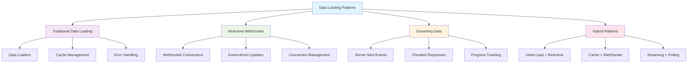

---

## 1. Traditional Data Loading Patterns

### 1.1 Data Loader Architecture

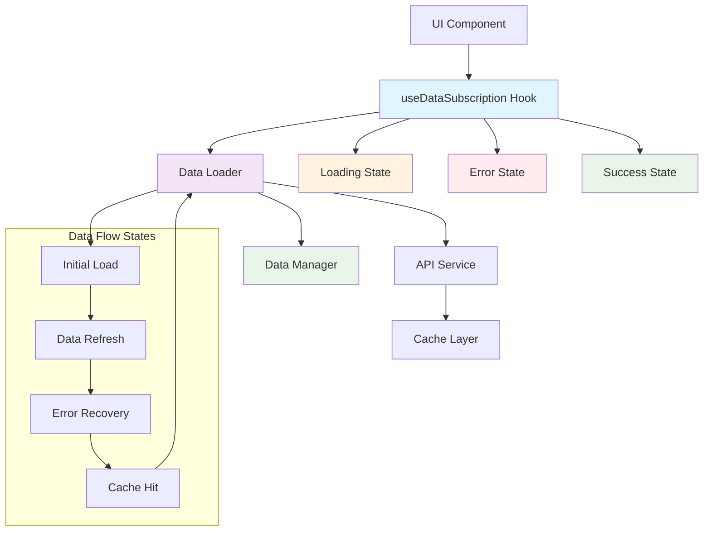

**Universal Principle**: Separate data loading logic from UI components using standardized loader patterns with proper caching and error handling.

**Implementation Pattern**:

```typescript
// ✅ CORRECT: Data loader pattern
class UserDataLoader extends BaseDataLoader<UserData> {
  protected dataType: DataType = DataType.USERS;
  protected api: BaseApiService;

  constructor(api?: BaseApiService) {
    super();
    this.api = api || new BaseApiService();
  }

  protected async loadData(): Promise<UserData | null> {
    try {
      const response = await this.api.get("/users");
      
      if (response.error) {
        throw new Error(`Failed to load users: ${response.error}`);
      }

      return this.transformData(response.data);
    } catch (error) {
      this.setError(error as Error);
      throw error;
    }
  }

  private transformData(rawData: any[]): UserData {
    return {
      users: rawData.map(user => ({
        id: user.id,
        name: user.full_name,
        email: user.email_address,
        createdAt: new Date(user.created_at)
      }))
    };
  }

  public setUserData(data: UserData): void {
    this.setLoaded(data);
  }

  public clearUserData(): void {
    this.clear();
  }
}

// Hook for UI components
function useUsers() {
  return useDataSubscription<UserData>(DataType.USERS, {
    autoLoad: true,
    autoRefresh: false,
    refreshInterval: 30000,
  });
}
```

### 1.2 Cache Management Strategy

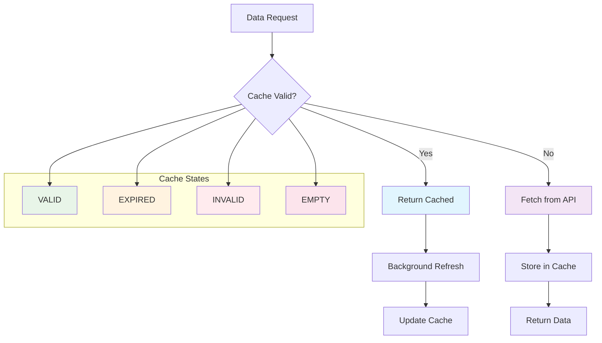

**Implementation Pattern**:

```typescript
// ✅ CORRECT: Cache management
class CacheManager {
  private cache = new Map<string, CacheEntry>();

  set(key: string, data: any, ttl: number = 300000): void {
    this.cache.set(key, {
      data,
      timestamp: Date.now(),
      ttl,
      status: CacheStatus.VALID
    });
  }

  get(key: string): any | null {
    const entry = this.cache.get(key);
    
    if (!entry) {
      return null;
    }

    if (this.isExpired(entry)) {
      entry.status = CacheStatus.EXPIRED;
      return null;
    }

    return entry.data;
  }

  private isExpired(entry: CacheEntry): boolean {
    return Date.now() - entry.timestamp > entry.ttl;
  }

  clear(key?: string): void {
    if (key) {
      this.cache.delete(key);
    } else {
      this.cache.clear();
    }
  }
}
```

### 1.3 Error Handling and Retry Logic

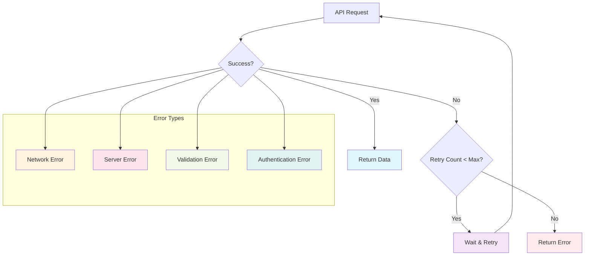

**Implementation Pattern**:

```typescript
// ✅ CORRECT: Error handling with retry logic
class ResilientDataLoader extends BaseDataLoader<any> {
  private maxRetries = 3;
  private retryDelay = 1000;

  protected async loadData(): Promise<any | null> {
    let lastError: Error;
    
    for (let attempt = 1; attempt <= this.maxRetries; attempt++) {
      try {
        const response = await this.api.get(this.endpoint);
        
        if (response.error) {
          throw new Error(`API error: ${response.error}`);
        }
        
        return response.data;
      } catch (error) {
        lastError = error as Error;
        
        if (attempt === this.maxRetries) {
          this.setError(lastError);
          throw lastError;
        }
        
        // Exponential backoff
        await this.delay(this.retryDelay * Math.pow(2, attempt - 1));
      }
    }
    
    return null;
  }

  private delay(ms: number): Promise<void> {
    return new Promise(resolve => setTimeout(resolve, ms));
  }
}
```

---

## 2. Real-time WebSocket Patterns

### 2.1 WebSocket Connection Management

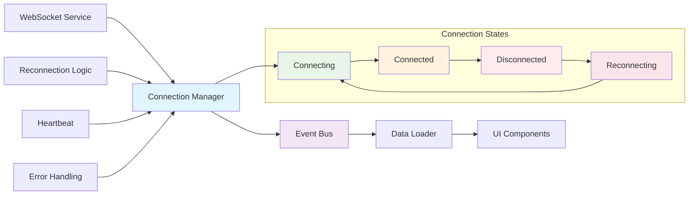

**Implementation Pattern**:

```typescript
// ✅ CORRECT: WebSocket connection management
class WebSocketManager {
  private connection: WebSocket | null = null;
  private reconnectAttempts = 0;
  private maxReconnectAttempts = 5;
  private reconnectDelay = 1000;
  private heartbeatInterval: NodeJS.Timeout | null = null;

  constructor(
    private url: string,
    private eventBus: EventBus,
    private options: WebSocketOptions = {}
  ) {}

  connect(): Promise<void> {
    return new Promise((resolve, reject) => {
      try {
        this.connection = new WebSocket(this.url);
        
        this.connection.onopen = () => {
          this.reconnectAttempts = 0;
          this.startHeartbeat();
          this.eventBus.emit('WEBSOCKET_CONNECTED');
          resolve();
        };

        this.connection.onmessage = (event) => {
          this.handleMessage(event);
        };

        this.connection.onclose = () => {
          this.handleDisconnect();
        };

        this.connection.onerror = (error) => {
          this.handleError(error);
          reject(error);
        };
      } catch (error) {
        reject(error);
      }
    });
  }

  private handleMessage(event: MessageEvent): void {
    try {
      const data = JSON.parse(event.data);
      this.eventBus.emit('WEBSOCKET_MESSAGE', data);
    } catch (error) {
      console.error('Failed to parse WebSocket message:', error);
    }
  }

  private handleDisconnect(): void {
    this.stopHeartbeat();
    this.eventBus.emit('WEBSOCKET_DISCONNECTED');
    
    if (this.reconnectAttempts < this.maxReconnectAttempts) {
      this.scheduleReconnect();
    }
  }

  private scheduleReconnect(): void {
    this.reconnectAttempts++;
    const delay = this.reconnectDelay * Math.pow(2, this.reconnectAttempts - 1);
    
    setTimeout(() => {
      this.connect().catch(console.error);
    }, delay);
  }

  private startHeartbeat(): void {
    if (this.options.heartbeatInterval) {
      this.heartbeatInterval = setInterval(() => {
        this.send({ type: 'heartbeat' });
      }, this.options.heartbeatInterval);
    }
  }

  private stopHeartbeat(): void {
    if (this.heartbeatInterval) {
      clearInterval(this.heartbeatInterval);
      this.heartbeatInterval = null;
    }
  }

  send(data: any): void {
    if (this.connection?.readyState === WebSocket.OPEN) {
      this.connection.send(JSON.stringify(data));
    }
  }

  disconnect(): void {
    this.stopHeartbeat();
    if (this.connection) {
      this.connection.close();
      this.connection = null;
    }
  }
}
```

### 2.2 Real-time Data Integration

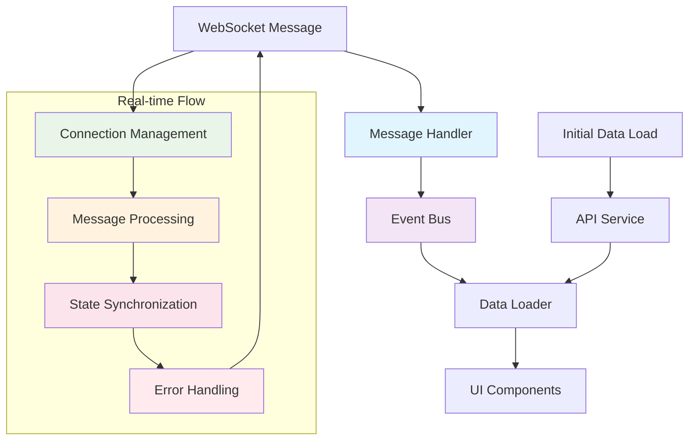

**Implementation Pattern**:

```typescript
// ✅ CORRECT: Real-time data integration
class RealTimeDataLoader extends BaseDataLoader<RealTimeData> {
  private webSocketManager: WebSocketManager;
  private initialDataLoaded = false;

  constructor(api: BaseApiService, webSocketUrl: string) {
    super();
    this.api = api;
    this.webSocketManager = new WebSocketManager(webSocketUrl, this.eventBus);
    this.setupWebSocketHandlers();
  }

  protected async loadData(): Promise<RealTimeData | null> {
    // Load initial data
    const initialData = await this.loadInitialData();
    
    // Setup real-time connection
    if (!this.initialDataLoaded) {
      await this.setupRealTimeConnection();
      this.initialDataLoaded = true;
    }

    return initialData;
  }

  private async loadInitialData(): Promise<RealTimeData | null> {
    try {
      const response = await this.api.get("/realtime-data");
      return response.data;
    } catch (error) {
      this.setError(error as Error);
      throw error;
    }
  }

  private async setupRealTimeConnection(): Promise<void> {
    try {
      await this.webSocketManager.connect();
    } catch (error) {
      console.error('Failed to establish WebSocket connection:', error);
    }
  }

  private setupWebSocketHandlers(): void {
    this.eventBus.on('WEBSOCKET_MESSAGE', (data) => {
      this.handleRealTimeUpdate(data);
    });

    this.eventBus.on('WEBSOCKET_DISCONNECTED', () => {
      this.handleDisconnection();
    });
  }

  private handleRealTimeUpdate(data: any): void {
    if (data.type === 'data_update') {
      const updatedData = this.transformRealTimeData(data.payload);
      this.setLoaded(updatedData);
    }
  }

  private handleDisconnection(): void {
    // Optionally fall back to polling
    this.startPollingFallback();
  }

  private startPollingFallback(): void {
    // Implement polling as fallback when WebSocket is unavailable
    const pollInterval = setInterval(async () => {
      try {
        const data = await this.loadInitialData();
        this.setLoaded(data);
      } catch (error) {
        console.error('Polling fallback failed:', error);
      }
    }, 5000);

    // Stop polling when WebSocket reconnects
    this.eventBus.once('WEBSOCKET_CONNECTED', () => {
      clearInterval(pollInterval);
    });
  }
}
```

---

## 3. Streaming Data Patterns

### 3.1 Server-Sent Events (SSE)

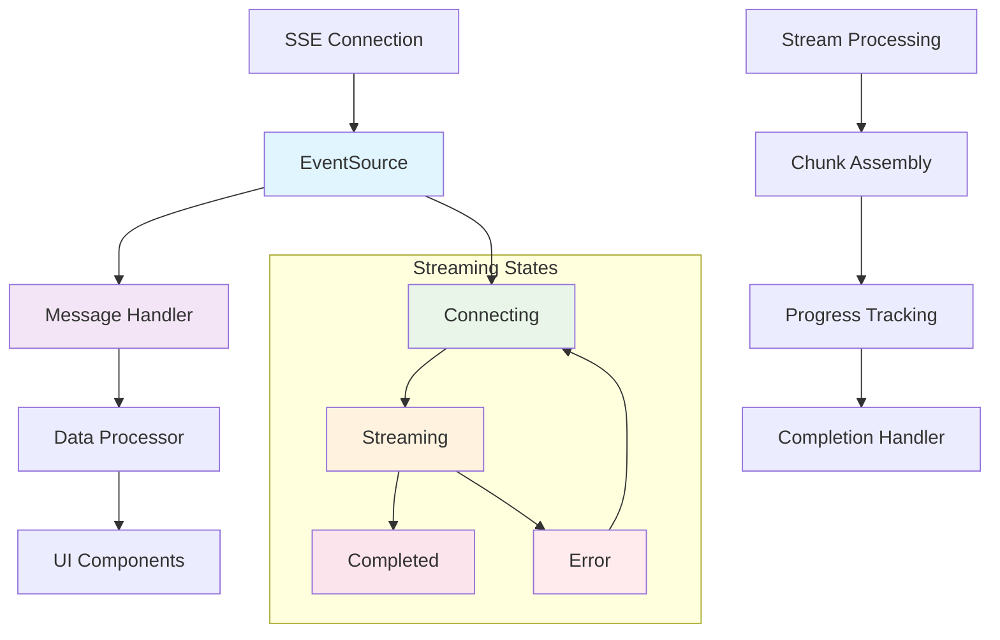

**Implementation Pattern**:

```typescript
// ✅ CORRECT: Server-Sent Events implementation
class SSEStreamManager {
  private eventSource: EventSource | null = null;
  private isStreaming = false;
  private partialData = '';
  private progress = 0;

  constructor(
    private url: string,
    private eventBus: EventBus,
    private options: SSEOptions = {}
  ) {}

  startStream(): Promise<void> {
    return new Promise((resolve, reject) => {
      try {
        this.eventSource = new EventSource(this.url);
        this.isStreaming = true;

        this.eventSource.onopen = () => {
          this.eventBus.emit('STREAM_STARTED');
          resolve();
        };

        this.eventSource.onmessage = (event) => {
          this.handleStreamMessage(event);
        };

        this.eventSource.onerror = (error) => {
          this.handleStreamError(error);
          reject(error);
        };

        // Handle specific event types
        this.eventSource.addEventListener('progress', (event) => {
          this.handleProgressUpdate(event);
        });

        this.eventSource.addEventListener('complete', (event) => {
          this.handleStreamComplete(event);
        });

      } catch (error) {
        reject(error);
      }
    });
  }

  private handleStreamMessage(event: MessageEvent): void {
    try {
      const data = JSON.parse(event.data);
      
      if (data.type === 'chunk') {
        this.partialData += data.content;
        this.eventBus.emit('STREAM_CHUNK_RECEIVED', {
          content: data.content,
          partialData: this.partialData,
          progress: this.progress
        });
      } else if (data.type === 'complete') {
        this.handleStreamComplete(event);
      }
    } catch (error) {
      console.error('Failed to parse SSE message:', error);
    }
  }

  private handleProgressUpdate(event: MessageEvent): void {
    try {
      const data = JSON.parse(event.data);
      this.progress = data.progress;
      
      this.eventBus.emit('STREAM_PROGRESS_UPDATE', {
        progress: this.progress,
        stage: data.stage
      });
    } catch (error) {
      console.error('Failed to parse progress update:', error);
    }
  }

  private handleStreamComplete(event: MessageEvent): void {
    this.isStreaming = false;
    this.eventBus.emit('STREAM_COMPLETED', {
      finalData: this.partialData,
      progress: 100
    });
    this.cleanup();
  }

  private handleStreamError(error: Event): void {
    this.isStreaming = false;
    this.eventBus.emit('STREAM_ERROR', error);
    this.cleanup();
  }

  private cleanup(): void {
    if (this.eventSource) {
      this.eventSource.close();
      this.eventSource = null;
    }
    this.partialData = '';
    this.progress = 0;
  }

  stopStream(): void {
    this.cleanup();
    this.eventBus.emit('STREAM_STOPPED');
  }
}
```

### 3.2 Chunked Response Processing

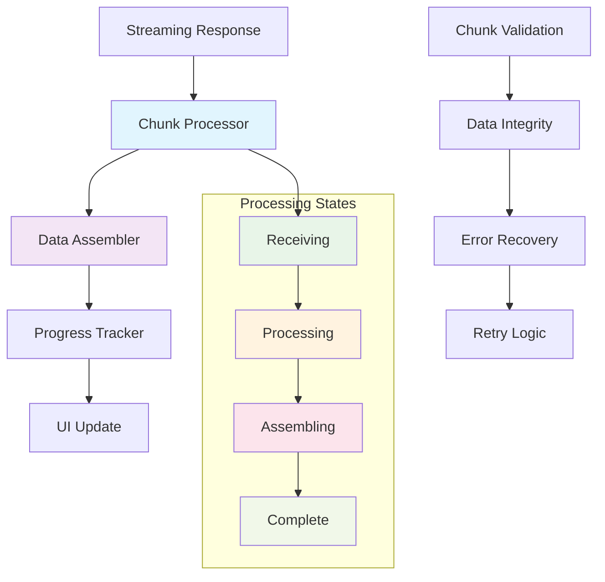

**Implementation Pattern**:

```typescript
// ✅ CORRECT: Chunked response processing
class ChunkedDataProcessor {
  private chunks: string[] = [];
  private expectedChunks = 0;
  private receivedChunks = 0;
  private isComplete = false;

  constructor(
    private eventBus: EventBus,
    private options: ChunkedProcessingOptions = {}
  ) {}

  processChunk(chunk: string, chunkIndex?: number): void {
    try {
      // Validate chunk
      if (!this.validateChunk(chunk)) {
        throw new Error(`Invalid chunk received: ${chunk}`);
      }

      // Store chunk
      if (chunkIndex !== undefined) {
        this.chunks[chunkIndex] = chunk;
      } else {
        this.chunks.push(chunk);
      }

      this.receivedChunks++;
      this.updateProgress();

      // Check if all chunks received
      if (this.receivedChunks === this.expectedChunks) {
        this.assembleData();
      }

      this.eventBus.emit('CHUNK_PROCESSED', {
        chunkIndex: chunkIndex || this.chunks.length - 1,
        totalChunks: this.expectedChunks,
        receivedChunks: this.receivedChunks
      });

    } catch (error) {
      this.handleChunkError(error, chunk);
    }
  }

  private validateChunk(chunk: string): boolean {
    // Implement chunk validation logic
    return chunk && chunk.length > 0;
  }

  private updateProgress(): void {
    const progress = (this.receivedChunks / this.expectedChunks) * 100;
    this.eventBus.emit('PROGRESS_UPDATE', { progress });
  }

  private assembleData(): void {
    try {
      const assembledData = this.chunks.join('');
      const parsedData = JSON.parse(assembledData);
      
      this.isComplete = true;
      this.eventBus.emit('DATA_ASSEMBLED', {
        data: parsedData,
        totalChunks: this.expectedChunks
      });

    } catch (error) {
      this.handleAssemblyError(error);
    }
  }

  private handleChunkError(error: Error, chunk: string): void {
    this.eventBus.emit('CHUNK_ERROR', {
      error: error.message,
      chunk,
      chunkIndex: this.chunks.length
    });
  }

  private handleAssemblyError(error: Error): void {
    this.eventBus.emit('ASSEMBLY_ERROR', {
      error: error.message,
      receivedChunks: this.receivedChunks,
      expectedChunks: this.expectedChunks
    });
  }

  reset(): void {
    this.chunks = [];
    this.expectedChunks = 0;
    this.receivedChunks = 0;
    this.isComplete = false;
  }
}
```

---

## 4. Hybrid Patterns

### 4.1 Initial Load + Real-time Updates

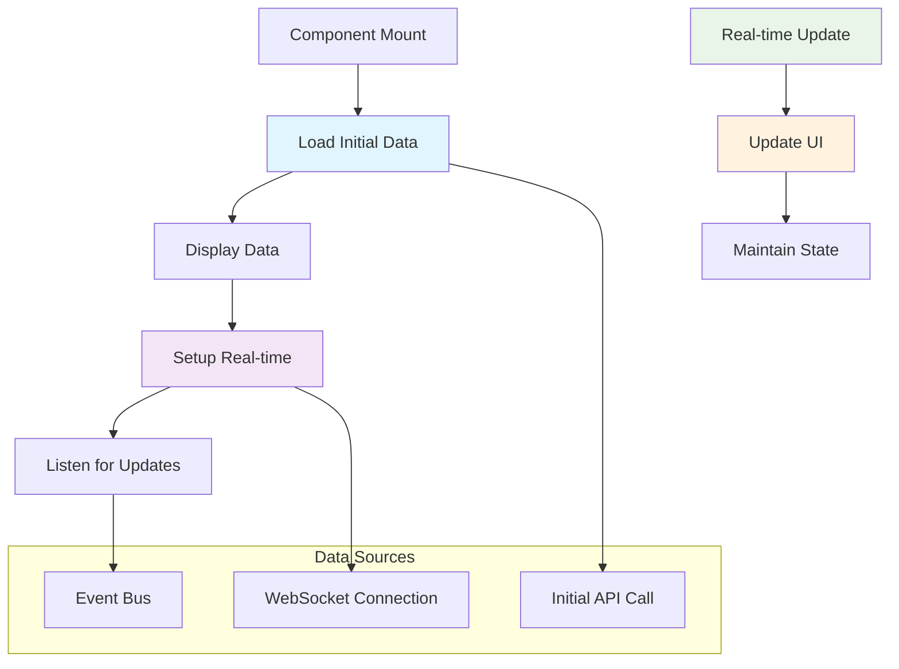

**Implementation Pattern**:

```typescript
// ✅ CORRECT: Hybrid pattern - Initial load + real-time updates
function useHybridData<T>(dataType: DataType, options: HybridDataOptions = {}) {
  const [data, setData] = useState<T | null>(null);
  const [isLoading, setIsLoading] = useState(true);
  const [error, setError] = useState<Error | null>(null);
  const [isRealTimeConnected, setIsRealTimeConnected] = useState(false);

  // Initial data loading
  const { data: initialData, isLoading: initialLoading, error: initialError } = 
    useDataSubscription<T>(dataType, {
      autoLoad: true,
      autoRefresh: false
    });

  // Real-time updates
  useEffect(() => {
    if (initialData && !isRealTimeConnected) {
      const unsubscribe = eventBus.on('REALTIME_DATA_UPDATE', (update) => {
        if (update.dataType === dataType) {
          setData(update.data);
        }
      });

      setIsRealTimeConnected(true);

      return () => {
        unsubscribe();
        setIsRealTimeConnected(false);
      };
    }
  }, [initialData, dataType, isRealTimeConnected]);

  // Combine initial and real-time data
  useEffect(() => {
    if (initialData) {
      setData(initialData);
      setIsLoading(false);
    }
  }, [initialData]);

  useEffect(() => {
    if (initialError) {
      setError(initialError);
      setIsLoading(false);
    }
  }, [initialError]);

  return {
    data,
    isLoading: initialLoading || isLoading,
    error: initialError || error,
    isRealTimeConnected,
    refresh: () => {
      // Trigger manual refresh
      eventBus.emit('DATA_REFRESH_REQUEST', { dataType });
    }
  };
}
```

### 4.2 Cache + WebSocket Pattern

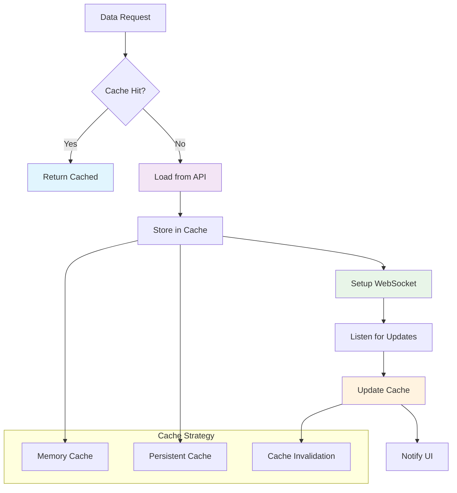

**Implementation Pattern**:

```typescript
// ✅ CORRECT: Cache + WebSocket pattern
class CachedRealTimeDataLoader extends BaseDataLoader<any> {
  private cacheManager: CacheManager;
  private webSocketManager: WebSocketManager;
  private cacheKey: string;

  constructor(
    api: BaseApiService,
    webSocketUrl: string,
    cacheKey: string
  ) {
    super();
    this.api = api;
    this.cacheManager = new CacheManager();
    this.webSocketManager = new WebSocketManager(webSocketUrl, this.eventBus);
    this.cacheKey = cacheKey;
  }

  protected async loadData(): Promise<any | null> {
    // Check cache first
    const cachedData = this.cacheManager.get(this.cacheKey);
    if (cachedData) {
      // Setup real-time updates for cached data
      this.setupRealTimeUpdates();
      return cachedData;
    }

    // Load from API
    const freshData = await this.loadFromAPI();
    
    // Cache the data
    this.cacheManager.set(this.cacheKey, freshData, 300000); // 5 minutes TTL
    
    // Setup real-time updates
    this.setupRealTimeUpdates();
    
    return freshData;
  }

  private async loadFromAPI(): Promise<any | null> {
    try {
      const response = await this.api.get(this.endpoint);
      return response.data;
    } catch (error) {
      this.setError(error as Error);
      throw error;
    }
  }

  private setupRealTimeUpdates(): void {
    this.webSocketManager.connect().then(() => {
      this.eventBus.on('WEBSOCKET_MESSAGE', (data) => {
        if (data.type === 'data_update' && data.cacheKey === this.cacheKey) {
          // Update cache with new data
          this.cacheManager.set(this.cacheKey, data.payload);
          
          // Notify subscribers
          this.setLoaded(data.payload);
        }
      });
    }).catch(console.error);
  }

  public invalidateCache(): void {
    this.cacheManager.clear(this.cacheKey);
  }
}
```

---

## 5. Performance Optimization

### 5.1 Data Loading Performance

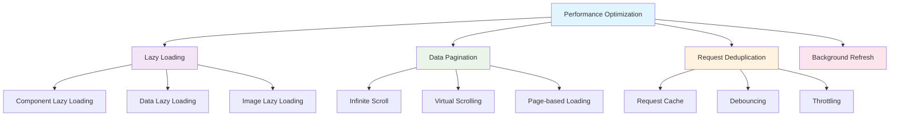

**Implementation Pattern**:

```typescript
// ✅ CORRECT: Performance-optimized data loading
class OptimizedDataLoader extends BaseDataLoader<any> {
  private requestCache = new Map<string, Promise<any>>();
  private debounceTimers = new Map<string, NodeJS.Timeout>();

  protected async loadData(): Promise<any | null> {
    const cacheKey = this.generateCacheKey();
    
    // Check for existing request
    if (this.requestCache.has(cacheKey)) {
      return this.requestCache.get(cacheKey);
    }

    // Create new request
    const requestPromise = this.executeRequest();
    this.requestCache.set(cacheKey, requestPromise);

    try {
      const result = await requestPromise;
      this.requestCache.delete(cacheKey);
      return result;
    } catch (error) {
      this.requestCache.delete(cacheKey);
      throw error;
    }
  }

  private async executeRequest(): Promise<any | null> {
    // Implement actual request logic
    const response = await this.api.get(this.endpoint);
    return response.data;
  }

  private generateCacheKey(): string {
    // Generate unique cache key based on request parameters
    return `${this.endpoint}_${JSON.stringify(this.params)}`;
  }

  // Debounced refresh method
  public debouncedRefresh(debounceMs: number = 300): void {
    const cacheKey = this.generateCacheKey();
    
    if (this.debounceTimers.has(cacheKey)) {
      clearTimeout(this.debounceTimers.get(cacheKey)!);
    }

    const timer = setTimeout(() => {
      this.refresh();
      this.debounceTimers.delete(cacheKey);
    }, debounceMs);

    this.debounceTimers.set(cacheKey, timer);
  }
}
```

---

## 6. Error Handling and Recovery

### 6.1 Comprehensive Error Strategy

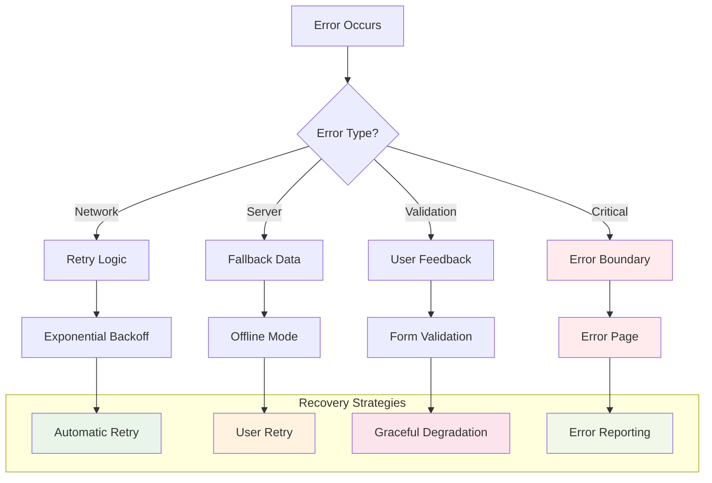

**Implementation Pattern**:

```typescript
// ✅ CORRECT: Comprehensive error handling
class ResilientDataLoader extends BaseDataLoader<any> {
  private retryConfig = {
    maxRetries: 3,
    baseDelay: 1000,
    maxDelay: 10000
  };

  protected async loadData(): Promise<any | null> {
    let lastError: Error;
    
    for (let attempt = 1; attempt <= this.retryConfig.maxRetries; attempt++) {
      try {
        const result = await this.executeRequestWithTimeout();
        return result;
      } catch (error) {
        lastError = error as Error;
        
        if (this.shouldRetry(error, attempt)) {
          await this.delay(this.calculateRetryDelay(attempt));
          continue;
        }
        
        break;
      }
    }
    
    this.setError(lastError!);
    throw lastError!;
  }

  private shouldRetry(error: Error, attempt: number): boolean {
    // Don't retry on validation errors or after max attempts
    if (attempt >= this.retryConfig.maxRetries) {
      return false;
    }
    
    // Retry on network errors, timeouts, and server errors
    return this.isRetryableError(error);
  }

  private isRetryableError(error: Error): boolean {
    const retryableErrors = [
      'NetworkError',
      'TimeoutError',
      'ECONNRESET',
      'ENOTFOUND'
    ];
    
    return retryableErrors.some(retryableError => 
      error.message.includes(retryableError)
    );
  }

  private calculateRetryDelay(attempt: number): number {
    const delay = this.retryConfig.baseDelay * Math.pow(2, attempt - 1);
    return Math.min(delay, this.retryConfig.maxDelay);
  }

  private async executeRequestWithTimeout(): Promise<any | null> {
    const timeout = 10000; // 10 seconds
    
    return Promise.race([
      this.api.get(this.endpoint),
      new Promise((_, reject) => 
        setTimeout(() => reject(new Error('Request timeout')), timeout)
      )
    ]);
  }
}
```

---

## 7. Testing Strategies

### 7.1 Testing Data Loading Patterns

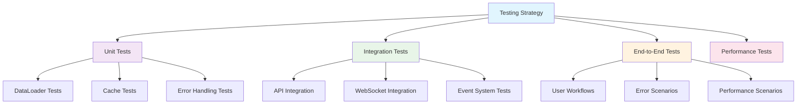

**Implementation Pattern**:

```typescript
// ✅ CORRECT: Testing data loading patterns
describe('DataLoader Integration', () => {
  let dataLoader: TestDataLoader;
  let mockApi: jest.Mocked<BaseApiService>;
  let mockEventBus: jest.Mocked<EventBus>;

  beforeEach(() => {
    mockApi = createMockApiService();
    mockEventBus = createMockEventBus();
    dataLoader = new TestDataLoader(mockApi, mockEventBus);
  });

  it('should load data and emit events', async () => {
    const mockData = { id: 1, name: 'Test' };
    mockApi.get.mockResolvedValue({ data: mockData });

    const eventSpy = jest.fn();
    mockEventBus.emit.mockImplementation(eventSpy);

    const result = await dataLoader.load();

    expect(result).toEqual(mockData);
    expect(eventSpy).toHaveBeenCalledWith('DATA_LOADED', {
      dataType: DataType.TEST,
      data: mockData
    });
  });

  it('should handle errors gracefully', async () => {
    const error = new Error('API Error');
    mockApi.get.mockRejectedValue(error);

    await expect(dataLoader.load()).rejects.toThrow('API Error');
    expect(dataLoader.getError()).toBe(error);
  });

  it('should retry on network errors', async () => {
    const mockData = { id: 1, name: 'Test' };
    mockApi.get
      .mockRejectedValueOnce(new Error('NetworkError'))
      .mockResolvedValueOnce({ data: mockData });

    const result = await dataLoader.load();

    expect(result).toEqual(mockData);
    expect(mockApi.get).toHaveBeenCalledTimes(2);
  });
});
```

---

## 8. Best Practices Summary

### ✅ Do's

1. **Use standardized data loader patterns** for consistent data management
2. **Implement proper caching strategies** with TTL and invalidation
3. **Handle errors gracefully** with retry logic and fallbacks
4. **Use event-driven architecture** for real-time updates
5. **Implement connection management** for WebSocket connections
6. **Process streaming data** with proper chunk handling
7. **Optimize performance** with lazy loading and request deduplication
8. **Test thoroughly** at unit, integration, and end-to-end levels
9. **Monitor and log** data loading performance and errors
10. **Implement graceful degradation** when real-time connections fail

### ❌ Don'ts

1. **Don't make direct API calls** in UI components
2. **Don't ignore error handling** in data loading
3. **Don't use polling** when WebSocket is available
4. **Don't cache sensitive data** without proper security
5. **Don't forget to cleanup** WebSocket connections
6. **Don't overload the UI** with too many simultaneous requests
7. **Don't skip loading states** for better UX
8. **Don't ignore performance** when implementing real-time features
9. **Don't forget to test** error scenarios and edge cases
10. **Don't use inconsistent patterns** across the application

---

## 9. Implementation Checklist

### Traditional Data Loading
- [ ] Implement BaseDataLoader class
- [ ] Create specific data loaders for each data type
- [ ] Implement caching strategy with TTL
- [ ] Add error handling and retry logic
- [ ] Create useDataSubscription hook
- [ ] Test data loading scenarios

### Real-time WebSocket
- [ ] Implement WebSocket connection management
- [ ] Add reconnection logic with exponential backoff
- [ ] Handle connection state changes
- [ ] Implement message processing
- [ ] Add error handling for connection failures
- [ ] Test WebSocket scenarios

### Streaming Data
- [ ] Implement SSE or chunked response handling
- [ ] Add progress tracking
- [ ] Handle streaming errors
- [ ] Implement data assembly for chunks
- [ ] Add completion handling
- [ ] Test streaming scenarios

### Performance Optimization
- [ ] Implement request deduplication
- [ ] Add lazy loading for heavy data
- [ ] Implement pagination for large datasets
- [ ] Add background refresh capabilities
- [ ] Monitor performance metrics
- [ ] Test performance scenarios

### Error Handling
- [ ] Implement comprehensive error strategies
- [ ] Add retry logic with exponential backoff
- [ ] Implement graceful degradation
- [ ] Add error reporting and monitoring
- [ ] Test error scenarios
- [ ] Document error handling procedures

---

## Conclusion

Data loading patterns are crucial for building scalable, maintainable, and user-friendly enterprise applications. By following these guidelines, you can implement robust data loading solutions that handle traditional request/response patterns, real-time updates, and streaming data effectively.

### Key Takeaways

1. **Architecture First**: Design with scalability and maintainability in mind
2. **User Experience**: Prioritize loading states and error handling
3. **Performance**: Optimize for speed and efficiency
4. **Reliability**: Implement robust error handling and recovery
5. **Testing**: Test thoroughly at all levels
6. **Monitoring**: Track performance and errors comprehensively

### Success Metrics

- **Performance**: < 2s initial load times
- **Reliability**: 99.9%+ uptime for data services
- **User Experience**: < 500ms response times for real-time updates
- **Error Rate**: < 1% error rate for data loading
- **Test Coverage**: > 80% code coverage for data loading logic

By following these patterns and principles, you can build enterprise-grade data loading systems that scale with your business needs while providing excellent user experiences.

---

**Last Updated**: January 2025  
**Version**: 1.0  
**Status**: Production Ready 