# Enterprise-Grade UI Systems: Universal Design & Architecture Guide

## Executive Summary

This guide distills universal principles for building enterprise-grade UI systems, derived from analyzing production-scale applications. These patterns ensure scalability, maintainability, and reliability across any technology stack.


```mermaid
graph TD
    A[Enterprise UI System] --> B[Architecture Layer]
    A --> C[Data Layer]
    A --> D[UI/UX Layer]
    A --> E[Performance Layer]
    A --> F[Security Layer]
    A --> G[Testing Layer]
    A --> H[Monitoring Layer]

    B --> B1[State Machine]
    B --> B2[Event-Driven Architecture]
    B --> B3[Service Orchestration]

    C --> C1[Data Loaders]
    C --> C2[Real-time Patterns]
    C --> C3[Single Source of Truth]

    D --> D1[Progressive Disclosure]
    D --> D2[Loading States]
    D --> D3[Error Handling]

    E --> E1[Memoization]
    E --> E2[Lazy Loading]
    E --> E3[Performance Monitoring]

    F --> F1[Authentication]
    F --> F2[Input Validation]
    F --> F3[Token Management]

    G --> G1[Unit Tests]
    G --> G2[Integration Tests]
    G --> G3[Mock Strategy]

    H --> H1[Error Tracking]
    H --> H2[Performance Metrics]
    H --> H3[Observability]

    style A fill:#e1f5fe
    style B fill:#f3e5f5
    style C fill:#e8f5e8
    style D fill:#fff3e0
    style E fill:#fce4ec
    style F fill:#f1f8e9
    style G fill:#e0f2f1
    style H fill:#fafafa
```

---

## Core Architectural Principles

### 1. State Machine Controls Component Rendering

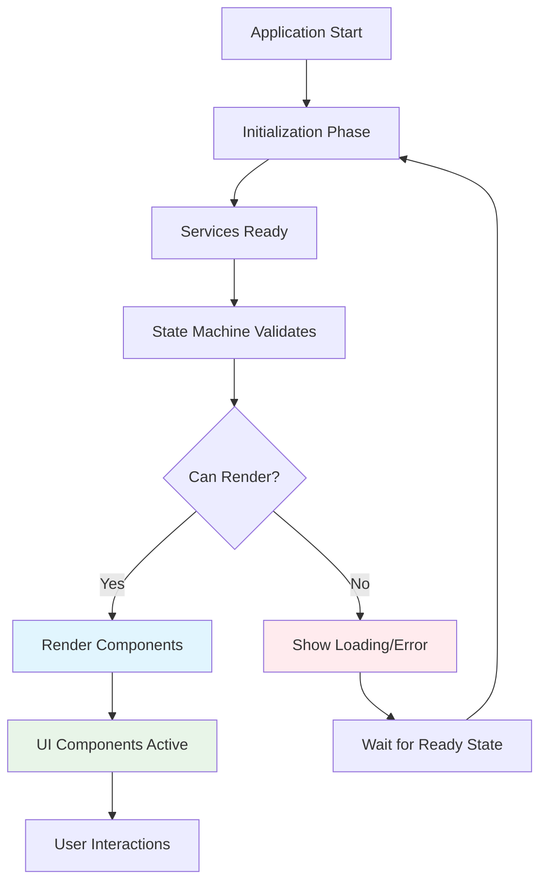
```mermaid
graph TD
    A[Application Start] --> B[Initialization Phase]
    B --> C[Services Ready]
    C --> D[State Machine Validates]
    D --> E{Can Render?}
    E -->|Yes| F[Render Components]
    E -->|No| G[Show Loading/Error]

    F --> H[UI Components Active]
    G --> I[Wait for Ready State]

    H --> J[User Interactions]
    I --> B

    style F fill:#e1f5fe
    style G fill:#ffebee
    style H fill:#e8f5e8
```

**Universal Principle**: Components should never render until the system is in a known, stable state.

**Why It Matters**:

- Prevents race conditions and "not initialized" errors
- Ensures data consistency across the application
- Provides predictable user experience

**Implementation Pattern**:

```typescript
// ✅ CORRECT: State-driven rendering
const AppLayout = () => {
  const [systemState, setSystemState] = useState('initializing');

  if (systemState !== 'ready') {
    return <SystemLoadingState />;
  }

  return <ApplicationContent />;
};
```

### 2. Event-Driven Architecture

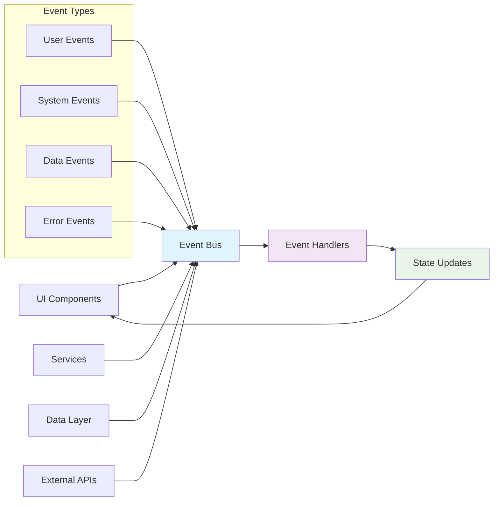
```mermaid
graph LR
    A[UI Components] --> B[Event Bus]
    C[Services] --> B
    D[Data Layer] --> B
    E[External APIs] --> B
    B --> F[Event Handlers]
    F --> G[State Updates]
    G --> A

    subgraph Event Types
        H[User Events]
        I[System Events]
        J[Data Events]
        K[Error Events]
    end

    H --> B
    I --> B
    J --> B
    K --> B

    style B fill:#e1f5fe
    style F fill:#f3e5f5
    style G fill:#e8f5e8
```

**Universal Principle**: All cross-module communication flows through a centralized event system.

**Implementation Pattern**:

```typescript
// ✅ CORRECT: Event-driven communication
class UserService {
  async login(credentials) {
    const result = await this.api.authenticate(credentials);

    if (result.success) {
      eventBus.emit("USER_AUTHENTICATED", { user: result.user });
    } else {
      eventBus.emit("AUTHENTICATION_FAILED", { error: result.error });
    }
  }
}
```

### 3. Single Source of Truth

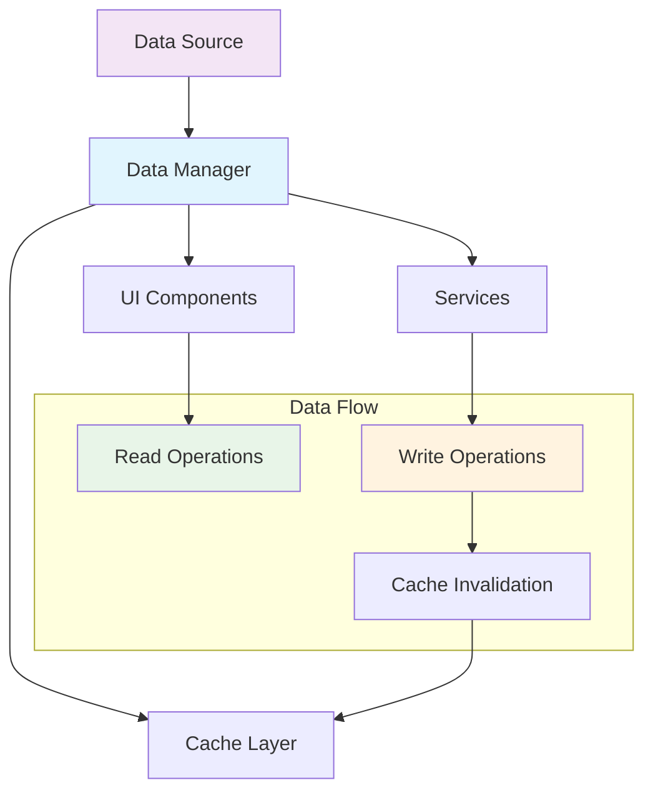
```mermaid
graph TD
    A[Data Source] --> B[Data Manager]
    B --> C[UI Components]
    B --> D[Services]
    B --> E[Cache Layer]

    subgraph Data Flow
        F[Read Operations]
        G[Write Operations]
        H[Cache Invalidation]
    end

    C --> F
    D --> G
    G --> H
    H --> E

    style B fill:#e1f5fe
    style A fill:#f3e5f5
    style F fill:#e8f5e8
    style G fill:#fff3e0
```

**Universal Principle**: Each piece of data has exactly one authoritative source.

**Implementation Pattern**:

```typescript
// ✅ CORRECT: Single data source
class DataManager {
  private dataSources = new Map();

  registerDataSource(key, source) {
    this.dataSources.set(key, source);
  }

  getData(key) {
    return this.dataSources.get(key)?.getData();
  }
}
```

---

## Service Architecture Patterns

### 1. Service Lifecycle Management

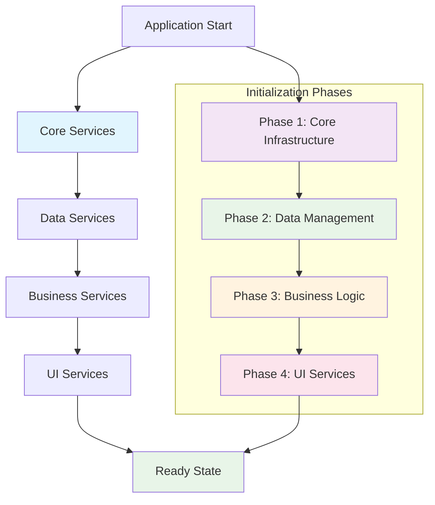
```mermaid
graph TD
    A[Application Start] --> B[Core Services]
    B --> C[Data Services]
    C --> D[Business Services]
    D --> E[UI Services]
    E --> F[Ready State]

    subgraph Initialization Phases
        G[Phase 1: Core Infrastructure]
        H[Phase 2: Data Management]
        I[Phase 3: Business Logic]
        J[Phase 4: UI Services]
    end

    A --> G
    G --> H
    H --> I
    I --> J
    J --> F

    style B fill:#e1f5fe
    style F fill:#e8f5e8
    style G fill:#f3e5f5
    style H fill:#e8f5e8
    style I fill:#fff3e0
    style J fill:#fce4ec
```

**Universal Principle**: Services must initialize in a specific order before any UI components can access them.

**Implementation Pattern**:

```typescript
// ✅ CORRECT: Ordered service initialization
class ServiceManager {
  async initialize() {
    // Phase 1: Core infrastructure
    await this.initializeEventBus();
    await this.initializeStateMachine();

    // Phase 2: Data management
    await this.initializeDataManager();
    await this.initializeCache();

    // Phase 3: Business services
    await this.initializeAuthService();
    await this.initializeApiService();
  }
}
```

### 2. Orchestrator Pattern

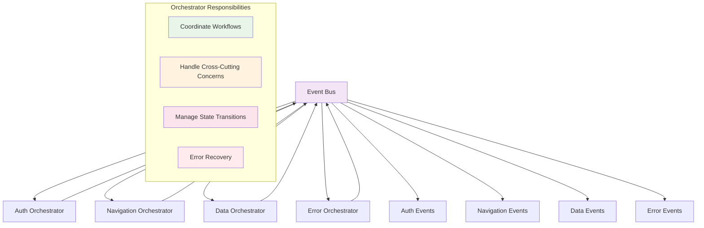
```mermaid
graph TD
    J[Event Bus]

    %% Orchestrators subscribe to and emit events via the Event Bus
    J --> B[Auth Orchestrator]
    J --> C[Navigation Orchestrator]
    J --> D[Data Orchestrator]
    J --> E[Error Orchestrator]

    B --> J
    C --> J
    D --> J
    E --> J

    %% Event categories
    J --> F[Auth Events]
    J --> G[Navigation Events]
    J --> H[Data Events]
    J --> I[Error Events]

    subgraph Orchestrator Responsibilities
        K[Coordinate Workflows]
        L[Handle Cross-Cutting Concerns]
        M[Manage State Transitions]
        N[Error Recovery]
    end

    style J fill:#f3e5f5
    style K fill:#e8f5e8
    style L fill:#fff3e0
    style M fill:#fce4ec
    style N fill:#ffebee
```

**Universal Principle**: Use independent, event-driven orchestrators for complex workflows. Orchestrators communicate via the event bus; there is no central/core orchestrator.

**Implementation Pattern**:

```typescript
// ✅ CORRECT: Independent, event-driven orchestrators
class AuthOrchestrator {
  constructor(eventBus, authService) {
    this.eventBus = eventBus;
    this.authService = authService;
    this.eventBus.on("AUTH_LOGIN_REQUEST", (payload) => this.handleLogin(payload));
  }

  async handleLogin({ credentials }) {
    const result = await this.authService.authenticate(credentials);
    if (result.success) {
      this.eventBus.emit("AUTH_SUCCESS", { user: result.user });
      this.eventBus.emit("NAVIGATION_REQUEST", { to: "/dashboard" });
    } else {
      this.eventBus.emit("AUTHENTICATION_FAILED", { error: result.error });
    }
  }
}

class NavigationOrchestrator {
  constructor(eventBus, router) {
    this.eventBus = eventBus;
    this.router = router;
    this.eventBus.on("NAVIGATION_REQUEST", ({ to }) => this.router.navigate(to));
  }
}
```

---

## Data Flow Architecture

### 1. Data Loader Pattern

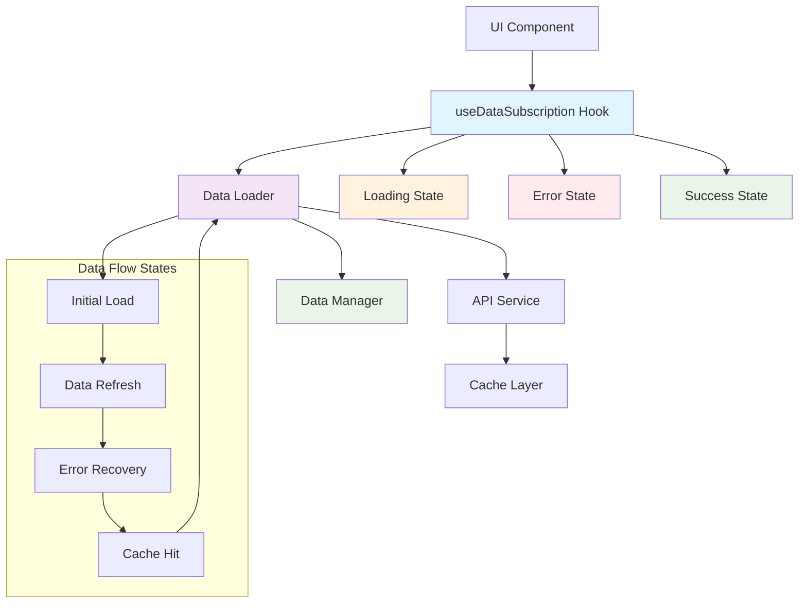
```mermaid
graph TB
    A[UI Component] --> B[useDataSubscription Hook]
    B --> C[Data Loader]
    C --> D[Data Manager]
    C --> E[API Service]
    E --> F[Cache Layer]

    B --> G[Loading State]
    B --> H[Error State]
    B --> I[Success State]

    subgraph Data Flow States
        J[Initial Load]
        K[Data Refresh]
        L[Error Recovery]
        M[Cache Hit]
    end

    C --> J
    J --> K
    K --> L
    L --> M
    M --> C

    style B fill:#e1f5fe
    style C fill:#f3e5f5
    style D fill:#e8f5e8
    style G fill:#fff3e0
    style H fill:#ffebee
    style I fill:#e8f5e8
```

**Universal Principle**: Separate data loading logic from UI components using a standardized loader pattern.

**Implementation Pattern**:

```typescript
// ✅ CORRECT: Data loader pattern
class UserDataLoader extends BaseDataLoader {
  async loadData() {
    const response = await this.api.get("/users");
    return this.transformData(response.data);
  }

  transformData(rawData) {
    return {
      users: rawData.map((user) => ({
        id: user.id,
        name: user.full_name,
        email: user.email_address,
      })),
    };
  }
}

// Hook for UI components
function useUsers() {
  return useDataSubscription(DataType.USERS, {
    autoLoad: true,
    refreshInterval: 30000,
  });
}
```

### 2. Real-time Data Patterns

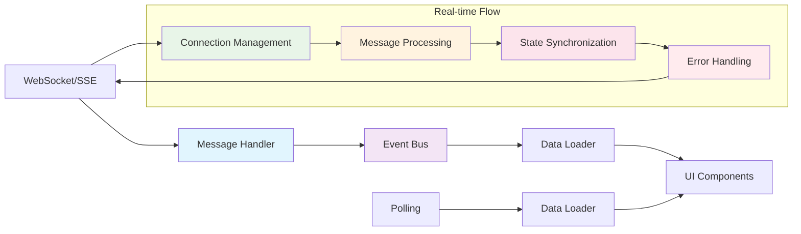
```mermaid
graph LR
    A[WebSocket/SSE] --> B[Message Handler]
    B --> C[Event Bus]
    C --> D[Data Loader]
    D --> E[UI Components]

    F[Polling] --> G[Data Loader]
    G --> E

    subgraph Real-time Flow
        H[Connection Management]
        I[Message Processing]
        J[State Synchronization]
        K[Error Handling]
    end

    A --> H
    H --> I
    I --> J
    J --> K
    K --> A

    style B fill:#e1f5fe
    style C fill:#f3e5f5
    style H fill:#e8f5e8
    style I fill:#fff3e0
    style J fill:#fce4ec
    style K fill:#ffebee
```

**Universal Principle**: Real-time data requires specialized patterns that differ from traditional request/response patterns.

**Implementation Pattern**:

```typescript
// ✅ CORRECT: Real-time data pattern
class RealTimeDataLoader extends BaseDataLoader {
  async loadData() {
    // Initial data load
    const initialData = await this.api.get("/realtime-data");

    // Setup real-time connection
    this.setupRealTimeConnection();

    return initialData;
  }

  setupRealTimeConnection() {
    this.connection = new WebSocket(this.getWebSocketUrl());

    this.connection.onmessage = (event) => {
      const data = JSON.parse(event.data);
      eventBus.emit("REALTIME_DATA_UPDATE", { data });
    };
  }
}
```

---

## UI/UX Design Patterns

### 1. Progressive Disclosure

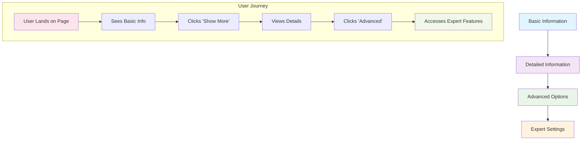
```mermaid
graph TD
    A[Basic Information] --> B[Detailed Information]
    B --> C[Advanced Options]
    C --> D[Expert Settings]

    subgraph User Journey
        E[User Lands on Page]
        F[Sees Basic Info]
        G[Clicks 'Show More']
        H[Views Details]
        I[Clicks 'Advanced']
        J[Accesses Expert Features]
    end

    E --> F
    F --> G
    G --> H
    H --> I
    I --> J

    style A fill:#e1f5fe
    style B fill:#f3e5f5
    style C fill:#e8f5e8
    style D fill:#fff3e0
    style E fill:#fce4ec
    style J fill:#f1f8e9
```

**Universal Principle**: Reveal information gradually to avoid overwhelming users.

**Implementation Pattern**:

```typescript
// ✅ CORRECT: Progressive disclosure
function UserProfile() {
  const [detailLevel, setDetailLevel] = useState('basic');

  return (
    <div>
      {/* Always visible */}
      <BasicInfo user={user} />

      {/* Expandable sections */}
      {detailLevel === 'detailed' && <DetailedInfo user={user} />}
      {detailLevel === 'advanced' && <AdvancedInfo user={user} />}

      <Button onClick={() => setDetailLevel(getNextLevel(detailLevel))}>
        Show More
      </Button>
    </div>
  );
}
```

### 2. Loading State Hierarchy

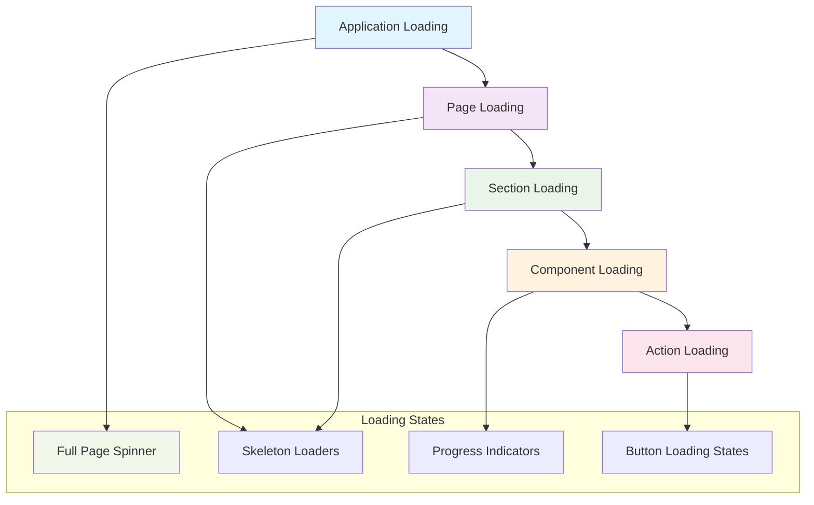
```mermaid
graph TD
    A[Application Loading] --> B[Page Loading]
    B --> C[Section Loading]
    C --> D[Component Loading]
    D --> E[Action Loading]

    subgraph Loading States
        F[Full Page Spinner]
        G[Skeleton Loaders]
        H[Progress Indicators]
        I[Button Loading States]
    end

    A --> F
    B --> G
    C --> G
    D --> H
    E --> I

    style A fill:#e1f5fe
    style B fill:#f3e5f5
    style C fill:#e8f5e8
    style D fill:#fff3e0
    style E fill:#fce4ec
    style F fill:#f1f8e9
```

**Universal Principle**: Provide appropriate loading feedback at each level of the application.

**Implementation Pattern**:

```typescript
// ✅ CORRECT: Hierarchical loading states
function AppLayout() {
  const { isLoading: appLoading } = useAppState();

  if (appLoading) {
    return <ApplicationLoader />;
  }

  return (
    <PageLayout>
      <PageContent />
    </PageLayout>
  );
}

function PageContent() {
  const { isLoading: pageLoading } = usePageData();

  if (pageLoading) {
    return <PageSkeleton />;
  }

  return (
    <div>
      <SectionA />
      <SectionB />
    </div>
  );
}
```

### 3. Error Handling Patterns

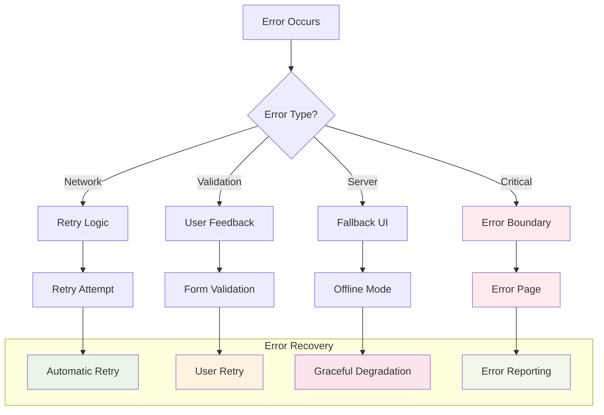
```mermaid
graph TD
    A[Error Occurs] --> B{Error Type?}
    B -->|Network| C[Retry Logic]
    B -->|Validation| D[User Feedback]
    B -->|Server| E[Fallback UI]
    B -->|Critical| F[Error Boundary]

    C --> G[Retry Attempt]
    D --> H[Form Validation]
    E --> I[Offline Mode]
    F --> J[Error Page]

    subgraph Error Recovery
        K[Automatic Retry]
        L[User Retry]
        M[Graceful Degradation]
        N[Error Reporting]
    end

    G --> K
    H --> L
    I --> M
    J --> N

    style F fill:#ffebee
    style J fill:#ffebee
    style K fill:#e8f5e8
    style L fill:#fff3e0
    style M fill:#fce4ec
    style N fill:#f1f8e9
```

**Universal Principle**: Handle errors gracefully at appropriate levels with clear user feedback.

**Implementation Pattern**:

```typescript
// ✅ CORRECT: Hierarchical error handling
class ErrorBoundary extends React.Component {
  constructor(props) {
    super(props);
    this.state = { hasError: false, error: null };
  }

  static getDerivedStateFromError(error) {
    return { hasError: true, error };
  }

  componentDidCatch(error, errorInfo) {
    // Log error for debugging
    errorService.logError(error, errorInfo);

    // Emit error event for orchestration
    eventBus.emit('CRITICAL_ERROR', { error, context: errorInfo });
  }

  render() {
    if (this.state.hasError) {
      return <ErrorFallback error={this.state.error} />;
    }

    return this.props.children;
  }
}

// Component-level error handling
function UserProfile() {
  const { data: user, error, isLoading } = useUserData();

  if (error) {
    return <UserProfileError error={error} onRetry={refetch} />;
  }

  if (isLoading) {
    return <UserProfileSkeleton />;
  }

  return <UserProfileContent user={user} />;
}
```

---

## Performance Patterns

### 1. Memoization Strategy

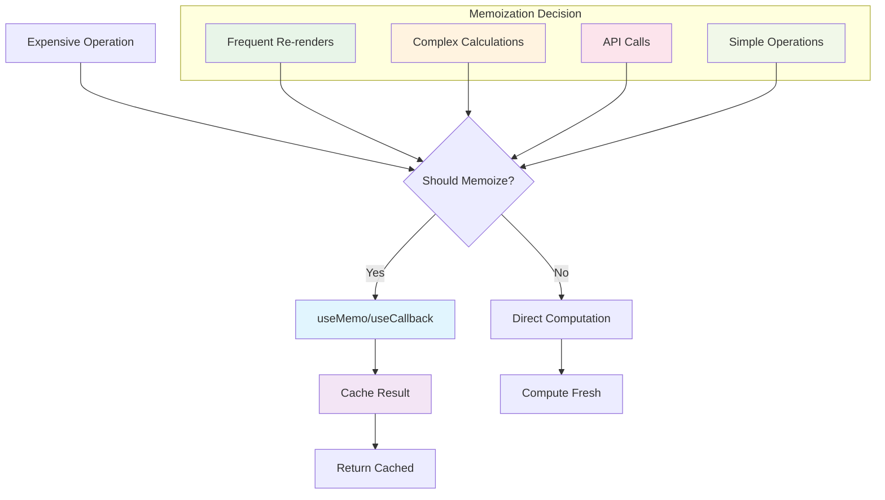
```mermaid
graph TD
    A[Expensive Operation] --> B{Should Memoize?}
    B -->|Yes| C[useMemo/useCallback]
    B -->|No| D[Direct Computation]

    C --> E[Cache Result]
    E --> F[Return Cached]

    D --> G[Compute Fresh]

    subgraph Memoization Decision
        H[Frequent Re-renders]
        I[Complex Calculations]
        J[API Calls]
        K[Simple Operations]
    end

    H --> B
    I --> B
    J --> B
    K --> B

    style C fill:#e1f5fe
    style E fill:#f3e5f5
    style H fill:#e8f5e8
    style I fill:#fff3e0
    style J fill:#fce4ec
    style K fill:#f1f8e9
```

**Universal Principle**: Memoize expensive operations but avoid premature optimization.

**Implementation Pattern**:

```typescript
// ✅ CORRECT: Strategic memoization
function DataTable({ data, filters, sortBy }) {
  // Memoize expensive filtering and sorting
  const processedData = useMemo(() => {
    return data
      .filter(item => applyFilters(item, filters))
      .sort((a, b) => sortBy(a, b));
  }, [data, filters, sortBy]);

  // Memoize event handlers
  const handleRowClick = useCallback((rowId) => {
    eventBus.emit('ROW_SELECTED', { rowId });
  }, []);

  return (
    <table>
      {processedData.map(row => (
        <TableRow
          key={row.id}
          data={row}
          onClick={handleRowClick}
        />
      ))}
    </table>
  );
}
```

### 2. Lazy Loading Patterns

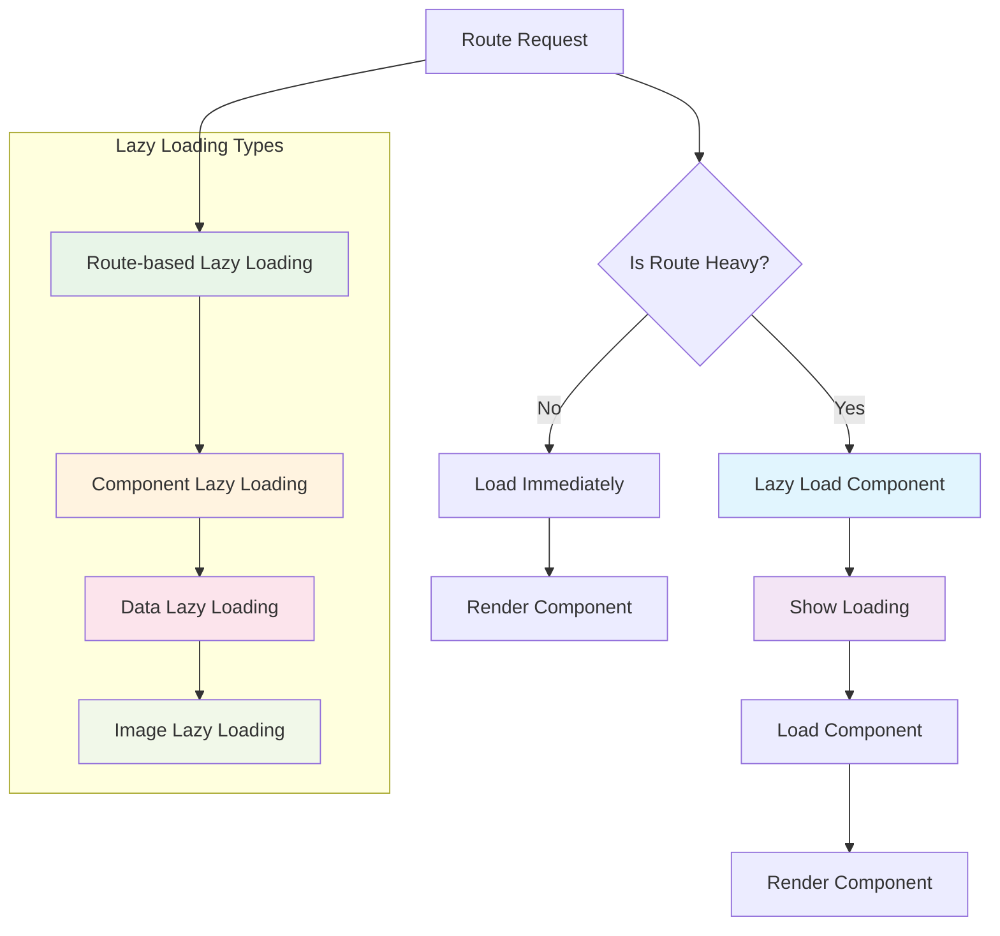
```mermaid
graph TD
    A[Route Request] --> B{Is Route Heavy?}
    B -->|Yes| C[Lazy Load Component]
    B -->|No| D[Load Immediately]

    C --> E[Show Loading]
    E --> F[Load Component]
    F --> G[Render Component]

    D --> H[Render Component]

    subgraph Lazy Loading Types
        I[Route-based Lazy Loading]
        J[Component Lazy Loading]
        K[Data Lazy Loading]
        L[Image Lazy Loading]
    end

    A --> I
    I --> J
    J --> K
    K --> L

    style C fill:#e1f5fe
    style E fill:#f3e5f5
    style I fill:#e8f5e8
    style J fill:#fff3e0
    style K fill:#fce4ec
    style L fill:#f1f8e9
```

**Universal Principle**: Load resources on-demand to improve initial load performance.

**Implementation Pattern**:

```typescript
// ✅ CORRECT: Lazy loading
const Dashboard = lazy(() => import('./Dashboard'));
const Analytics = lazy(() => import('./Analytics'));
const Settings = lazy(() => import('./Settings'));

function App() {
  return (
    <Suspense fallback={<PageLoader />}>
      <Routes>
        <Route path="/dashboard" element={<Dashboard />} />
        <Route path="/analytics" element={<Analytics />} />
        <Route path="/settings" element={<Settings />} />
      </Routes>
    </Suspense>
  );
}

// Data lazy loading
function UserList() {
  const [users, setUsers] = useState([]);
  const [hasMore, setHasMore] = useState(true);

  const loadMore = useCallback(async () => {
    const newUsers = await userService.getUsers(users.length, 20);
    setUsers(prev => [...prev, ...newUsers]);
    setHasMore(newUsers.length === 20);
  }, [users.length]);

  return (
    <InfiniteScroll onLoadMore={loadMore} hasMore={hasMore}>
      {users.map(user => <UserCard key={user.id} user={user} />)}
    </InfiniteScroll>
  );
}
```

---

## Testing Patterns

### 1. Testing Hierarchy

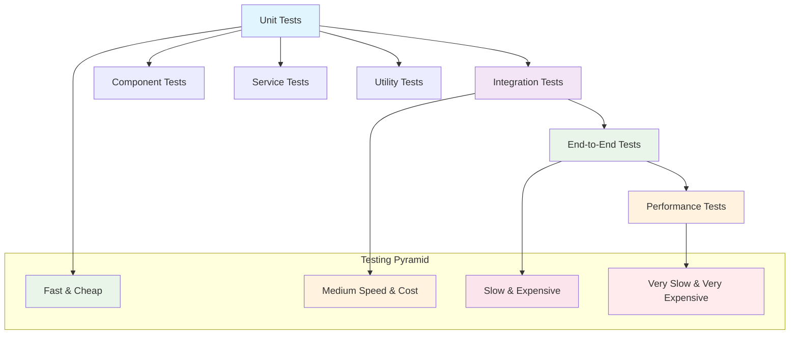
```mermaid
graph TD
    A[Unit Tests] --> B[Integration Tests]
    B --> C[End-to-End Tests]
    C --> D[Performance Tests]

    A --> E[Component Tests]
    A --> F[Service Tests]
    A --> G[Utility Tests]

    subgraph Testing Pyramid
        H[Fast & Cheap]
        I[Medium Speed & Cost]
        J[Slow & Expensive]
        K[Very Slow & Very Expensive]
    end

    A --> H
    B --> I
    C --> J
    D --> K

    style A fill:#e1f5fe
    style B fill:#f3e5f5
    style C fill:#e8f5e8
    style D fill:#fff3e0
    style H fill:#e8f5e8
    style I fill:#fff3e0
    style J fill:#fce4ec
    style K fill:#ffebee
```

**Universal Principle**: Test at appropriate levels with clear responsibilities.

**Implementation Pattern**:

```typescript
// ✅ CORRECT: Unit test for service
describe("UserService", () => {
  let userService;
  let mockApi;

  beforeEach(() => {
    mockApi = {
      get: jest.fn(),
      post: jest.fn(),
    };
    userService = new UserService(mockApi);
  });

  test("should fetch user by id", async () => {
    const mockUser = { id: "1", name: "John" };
    mockApi.get.mockResolvedValue({ data: mockUser });

    const result = await userService.getUser("1");

    expect(result).toEqual(mockUser);
    expect(mockApi.get).toHaveBeenCalledWith("/users/1");
  });
});

// ✅ CORRECT: Integration test for orchestrator
describe("AuthOrchestrator Integration", () => {
  test("should coordinate login flow", async () => {
    const orchestrator = new AuthOrchestrator();
    const mockEventBus = { emit: jest.fn() };

    await orchestrator.handleLogin({
      email: "test@example.com",
      password: "pass",
    });

    expect(mockEventBus.emit).toHaveBeenCalledWith(
      "AUTH_SUCCESS",
      expect.any(Object),
    );
    expect(mockEventBus.emit).toHaveBeenCalledWith(
      "NAVIGATION_REQUEST",
      expect.any(Object),
    );
  });
});
```

### 2. Mock Strategy

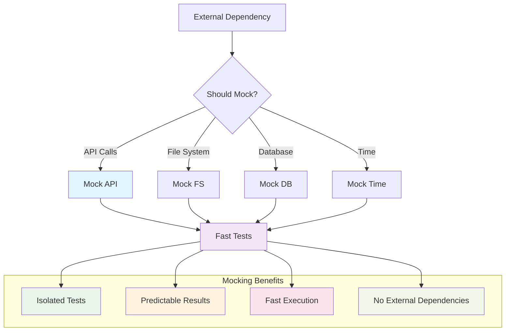
```mermaid
graph TD
    A[External Dependency] --> B{Should Mock?}
    B -->|API Calls| C[Mock API]
    B -->|File System| D[Mock FS]
    B -->|Database| E[Mock DB]
    B -->|Time| F[Mock Time]

    C --> G[Fast Tests]
    D --> G
    E --> G
    F --> G

    subgraph Mocking Benefits
        H[Isolated Tests]
        I[Predictable Results]
        J[Fast Execution]
        K[No External Dependencies]
    end

    G --> H
    G --> I
    G --> J
    G --> K

    style C fill:#e1f5fe
    style G fill:#f3e5f5
    style H fill:#e8f5e8
    style I fill:#fff3e0
    style J fill:#fce4ec
    style K fill:#f1f8e9
```

**Universal Principle**: Mock external dependencies to create fast, reliable tests.

**Implementation Pattern**:

```typescript
// ✅ CORRECT: Mocking external dependencies
jest.mock("../services/api", () => ({
  ApiService: jest.fn().mockImplementation(() => ({
    get: jest.fn(),
    post: jest.fn(),
    put: jest.fn(),
    delete: jest.fn(),
  })),
}));

jest.mock("../services/eventBus", () => ({
  eventBus: {
    emit: jest.fn(),
    on: jest.fn(),
    off: jest.fn(),
  },
}));

// Test with mocked dependencies
describe("UserService", () => {
  test("should handle API errors gracefully", async () => {
    const mockApi = new ApiService();
    mockApi.get.mockRejectedValue(new Error("Network error"));

    const userService = new UserService(mockApi);

    await expect(userService.getUser("1")).rejects.toThrow("Network error");
  });
});
```

---

## Security Patterns

### 1. Authentication Flow

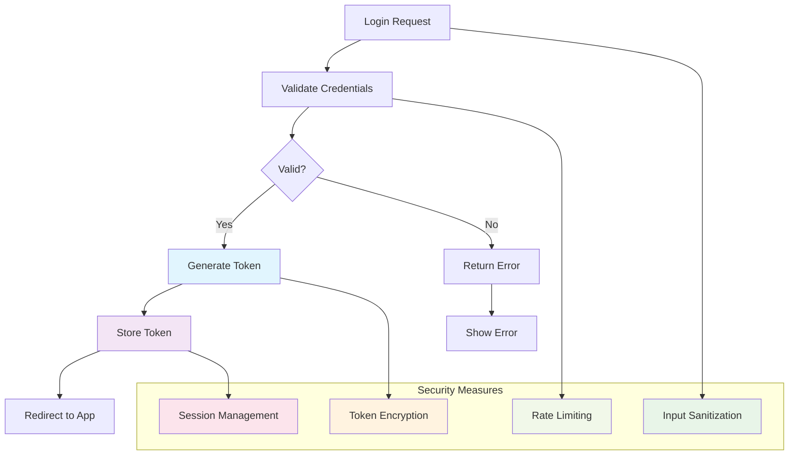
```mermaid
graph TD
    A[Login Request] --> B[Validate Credentials]
    B --> C{Valid?}
    C -->|Yes| D[Generate Token]
    C -->|No| E[Return Error]

    D --> F[Store Token]
    F --> G[Redirect to App]

    E --> H[Show Error]

    subgraph Security Measures
        I[Input Sanitization]
        J[Token Encryption]
        K[Session Management]
        L[Rate Limiting]
    end

    A --> I
    D --> J
    F --> K
    B --> L

    style D fill:#e1f5fe
    style F fill:#f3e5f5
    style I fill:#e8f5e8
    style J fill:#fff3e0
    style K fill:#fce4ec
    style L fill:#f1f8e9
```

**Universal Principle**: Implement secure authentication with proper token management.

**Implementation Pattern**:

```typescript
// ✅ CORRECT: Secure authentication
class AuthService {
  async login(credentials) {
    try {
      const response = await this.api.post("/auth/login", credentials);

      if (response.success) {
        // Store token securely
        this.tokenManager.setToken(response.token);

        // Emit success event
        eventBus.emit("AUTH_SUCCESS", { user: response.user });

        return { success: true, user: response.user };
      }
    } catch (error) {
      // Handle authentication errors
      eventBus.emit("AUTH_ERROR", { error: error.message });
      return { success: false, error: error.message };
    }
  }

  async validateToken() {
    const token = this.tokenManager.getToken();

    if (!token) {
      return false;
    }

    try {
      const response = await this.api.get("/auth/validate", {
        headers: { Authorization: `Bearer ${token}` },
      });

      return response.valid;
    } catch (error) {
      this.tokenManager.clearToken();
      return false;
    }
  }
}
```

### 2. Input Validation

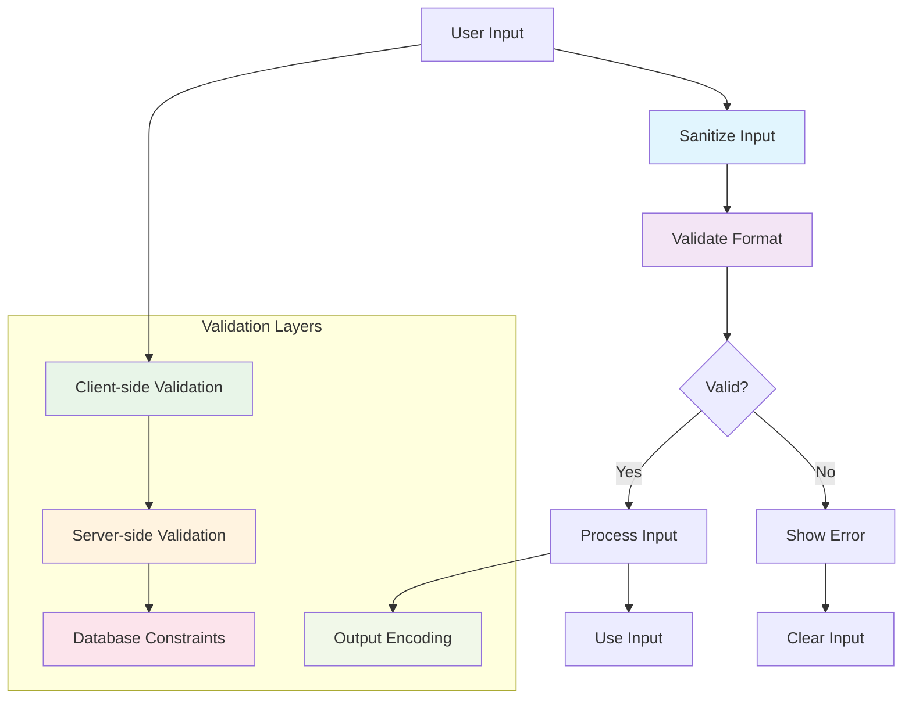
```mermaid
graph TD
    A[User Input] --> B[Sanitize Input]
    B --> C[Validate Format]
    C --> D{Valid?}
    D -->|Yes| E[Process Input]
    D -->|No| F[Show Error]

    E --> G[Use Input]
    F --> H[Clear Input]

    subgraph Validation Layers
        I[Client-side Validation]
        J[Server-side Validation]
        K[Database Constraints]
        L[Output Encoding]
    end

    A --> I
    I --> J
    J --> K
    E --> L

    style B fill:#e1f5fe
    style C fill:#f3e5f5
    style I fill:#e8f5e8
    style J fill:#fff3e0
    style K fill:#fce4ec
    style L fill:#f1f8e9
```

**Universal Principle**: Validate and sanitize all user inputs to prevent security vulnerabilities.

**Implementation Pattern**:

```typescript
// ✅ CORRECT: Input validation
class InputValidator {
  static validateEmail(email) {
    const emailRegex = /^[^\s@]+@[^\s@]+\.[^\s@]+$/;
    return emailRegex.test(email) && email.length <= 254;
  }

  static validatePassword(password) {
    return password.length >= 8 &&
           /[A-Z]/.test(password) &&
           /[a-z]/.test(password) &&
           /[0-9]/.test(password);
  }

  static sanitizeString(input) {
    return input.trim().replace(/[<>]/g, '');
  }
}

function LoginForm() {
  const [email, setEmail] = useState('');
  const [password, setPassword] = useState('');
  const [errors, setErrors] = useState({});

  const handleSubmit = (e) => {
    e.preventDefault();

    const sanitizedEmail = InputValidator.sanitizeString(email);
    const sanitizedPassword = InputValidator.sanitizeString(password);

    const newErrors = {};

    if (!InputValidator.validateEmail(sanitizedEmail)) {
      newErrors.email = 'Invalid email format';
    }

    if (!InputValidator.validatePassword(sanitizedPassword)) {
      newErrors.password = 'Password must be at least 8 characters with uppercase, lowercase, and number';
    }

    if (Object.keys(newErrors).length === 0) {
      authService.login({ email: sanitizedEmail, password: sanitizedPassword });
    } else {
      setErrors(newErrors);
    }
  };

  return (
    <form onSubmit={handleSubmit}>
      <input
        type="email"
        value={email}
        onChange={(e) => setEmail(e.target.value)}
        className={errors.email ? 'error' : ''}
      />
      {errors.email && <span className="error">{errors.email}</span>}

      <input
        type="password"
        value={password}
        onChange={(e) => setPassword(e.target.value)}
        className={errors.password ? 'error' : ''}
      />
      {errors.password && <span className="error">{errors.password}</span>}

      <button type="submit">Login</button>
    </form>
  );
}
```

---

## Monitoring & Observability

### 1. Error Tracking

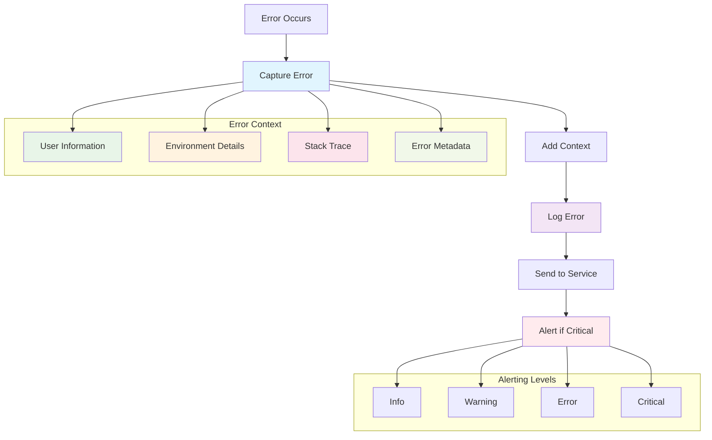
```mermaid
graph TD
    A[Error Occurs] --> B[Capture Error]
    B --> C[Add Context]
    C --> D[Log Error]
    D --> E[Send to Service]
    E --> F[Alert if Critical]

    subgraph Error Context
        G[User Information]
        H[Environment Details]
        I[Stack Trace]
        J[Error Metadata]
    end

    B --> G
    B --> H
    B --> I
    B --> J

    subgraph Alerting Levels
        K[Info]
        L[Warning]
        M[Error]
        N[Critical]
    end

    F --> K
    F --> L
    F --> M
    F --> N

    style B fill:#e1f5fe
    style D fill:#f3e5f5
    style F fill:#ffebee
    style G fill:#e8f5e8
    style H fill:#fff3e0
    style I fill:#fce4ec
    style J fill:#f1f8e9
```

**Universal Principle**: Implement comprehensive error tracking with context and alerting.

**Implementation Pattern**:

```typescript
// ✅ CORRECT: Error tracking
class ErrorTracker {
  constructor() {
    this.errorService = new ErrorReportingService();
  }

  captureError(error, context = {}) {
    const errorInfo = {
      message: error.message,
      stack: error.stack,
      timestamp: new Date().toISOString(),
      userAgent: navigator.userAgent,
      url: window.location.href,
      userId: this.getCurrentUserId(),
      ...context,
    };

    // Log locally for debugging
    console.error("Application Error:", errorInfo);

    // Send to error tracking service
    this.errorService.reportError(errorInfo);

    // Alert for critical errors
    if (this.isCriticalError(error)) {
      this.alertTeam(errorInfo);
    }
  }

  isCriticalError(error) {
    return (
      error.message.includes("Critical") ||
      error.message.includes("Fatal") ||
      error.code === "CRITICAL_ERROR"
    );
  }
}

// Global error handler
window.addEventListener("error", (event) => {
  errorTracker.captureError(event.error, {
    type: "unhandled",
    filename: event.filename,
    lineno: event.lineno,
    colno: event.colno,
  });
});
```

### 2. Performance Monitoring

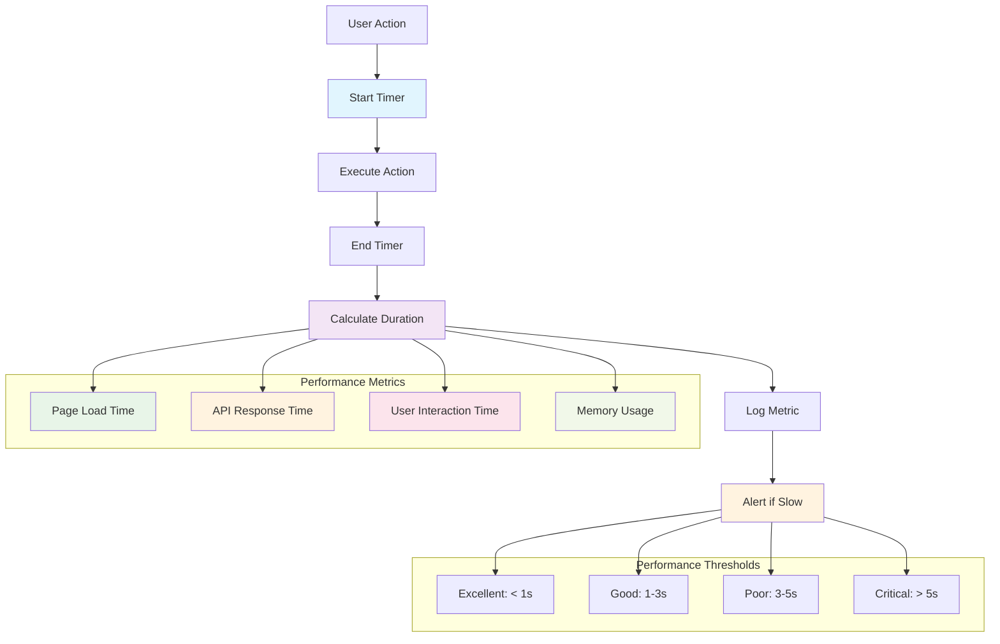
```mermaid
graph TD
    A[User Action] --> B[Start Timer]
    B --> C[Execute Action]
    C --> D[End Timer]
    D --> E[Calculate Duration]
    E --> F[Log Metric]
    F --> G[Alert if Slow]

    subgraph "Performance Metrics"
        H[Page Load Time]
        I[API Response Time]
        J[User Interaction Time]
        K[Memory Usage]
    end

    E --> H
    E --> I
    E --> J
    E --> K

    subgraph Performance Thresholds
        L[Excellent: &lt; 1s]
        M[Good: 1-3s]
        N[Poor: 3-5s]
        O[Critical: &gt; 5s]
    end

    G --> L
    G --> M
    G --> N
    G --> O

    style B fill:#e1f5fe
    style E fill:#f3e5f5
    style G fill:#fff3e0
    style H fill:#e8f5e8
    style I fill:#fff3e0
    style J fill:#fce4ec
    style K fill:#f1f8e9
```

**Universal Principle**: Monitor performance metrics to identify bottlenecks and optimize user experience.

**Implementation Pattern**:

```typescript
// ✅ CORRECT: Performance monitoring
class PerformanceMonitor {
  constructor() {
    this.metrics = new Map();
    this.thresholds = {
      pageLoad: 3000,
      apiCall: 2000,
      userInteraction: 100
    };
  }

  startTimer(operation) {
    const startTime = performance.now();
    this.metrics.set(operation, { startTime });
  }

  endTimer(operation, context = {}) {
    const metric = this.metrics.get(operation);
    if (!metric) return;

    const duration = performance.now() - metric.startTime;

    // Log performance metric
    this.logMetric(operation, duration, context);

    // Alert if performance is poor
    if (this.isSlow(operation, duration)) {
      this.alertSlowPerformance(operation, duration, context);
    }

    this.metrics.delete(operation);
  }

  isSlow(operation, duration) {
    const threshold = this.thresholds[operation];
    return threshold && duration > threshold;
  }

  logMetric(operation, duration, context) {
    const metric = {
      operation,
      duration,
      timestamp: new Date().toISOString(),
      ...context
    };

    // Send to monitoring service
    this.monitoringService.recordMetric(metric);
  }
}

// Usage in components
function UserList() {
  const { data: users, isLoading } = useUsers();

  useEffect(() => {
    if (!isLoading && users) {
      performanceMonitor.endTimer('userListLoad', {
        userCount: users.length
      });
    }
  }, [isLoading, users]);

  useEffect(() => {
    performanceMonitor.startTimer('userListLoad');
  }, []);

  return <UserTable users={users} />;
}
```

---

## System Architecture Overview

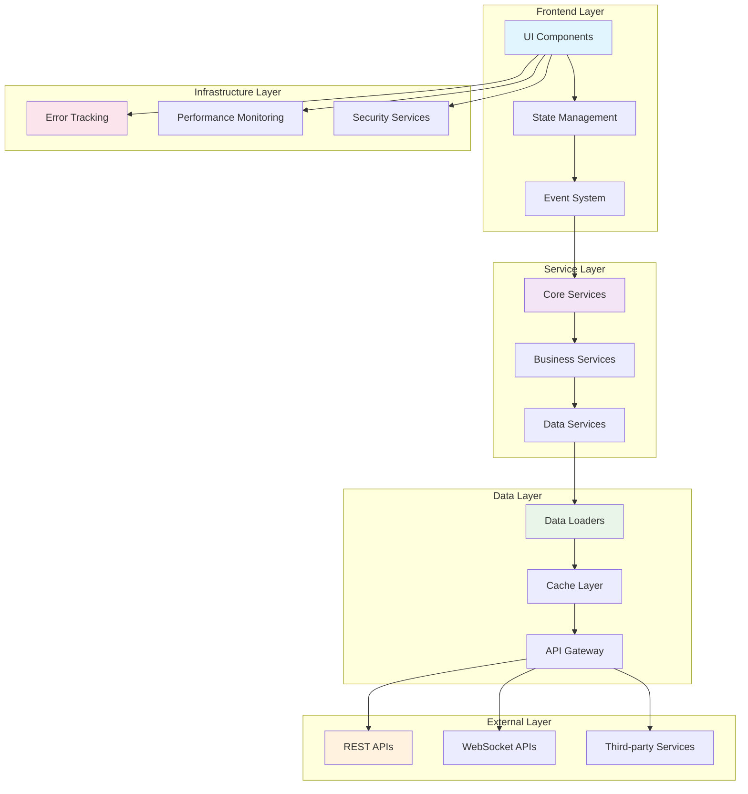
```mermaid
graph TB
    subgraph Frontend Layer
        A[UI Components]
        B[State Management]
        C[Event System]
    end

    subgraph Service Layer
        D[Core Services]
        E[Business Services]
        F[Data Services]
    end

    subgraph Data Layer
        G[Data Loaders]
        H[Cache Layer]
        I[API Gateway]
    end

    subgraph External Layer
        J[REST APIs]
        K[WebSocket APIs]
        L[Third-party Services]
    end

    subgraph Infrastructure Layer
        M[Error Tracking]
        N[Performance Monitoring]
        O[Security Services]
    end

    A --> B
    B --> C
    C --> D
    D --> E
    E --> F
    F --> G
    G --> H
    H --> I
    I --> J
    I --> K
    I --> L

    A --> M
    A --> N
    A --> O

    style A fill:#e1f5fe
    style D fill:#f3e5f5
    style G fill:#e8f5e8
    style J fill:#fff3e0
    style M fill:#fce4ec
```

## Data Flow Architecture

```mermaid
sequenceDiagram
    participant U as User
    participant UI as UI Component
    participant H as Hook
    participant DL as Data Loader
    participant DM as Data Manager
    participant API as API Service
    participant EB as Event Bus

    U->>UI: User Interaction
    UI->>H: useDataSubscription
    H->>DL: Load Data
    DL->>DM: Get Data
    DM->>API: API Call
    API-->>DM: Response
    DM-->>DL: Data
    DL-->>H: Transformed Data
    H-->>UI: State Update
    UI-->>U: UI Update

    Note over DL,EB: Real-time Updates
    API->>EB: WebSocket Message
    EB->>DL: Event
    DL->>H: Data Update
    H->>UI: Re-render
    UI-->>U: Real-time Update
```

## Component Lifecycle

```mermaid
stateDiagram
    [*] --> Initializing
    Initializing --> Loading: Services Ready
    Loading --> Ready: Data Loaded
    Loading --> Error: Load Failed
    Error --> Loading: Retry
    Ready --> Updating: Data Change
    Updating --> Ready: Update Complete
    Updating --> Error: Update Failed
    Ready --> [*]: Component Unmount
    Error --> [*]: Component Unmount
```

---

## Best Practices Summary

### ✅ Do's

1. **Use state machines to control component rendering**
2. **Implement event-driven architecture for cross-module communication**
3. **Maintain single source of truth for all data**
4. **Initialize services in proper order before rendering**
5. **Use independent, event-driven orchestrators for complex workflows** (e.g., navigation events handled only by `NavigationOrchestrator`)
6. **Implement data loader patterns for data management**
7. **Design with progressive disclosure**
8. **Provide hierarchical loading states**
9. **Handle errors gracefully at appropriate levels**
10. **Memoize expensive operations strategically**
11. **Lazy load heavy components and data**
12. **Test at appropriate levels with clear responsibilities**
13. **Mock external dependencies for reliable tests**
14. **Implement secure authentication with proper token management**
15. **Validate and sanitize all user inputs**
16. **Track errors with context and alerting**
17. **Monitor performance metrics**
18. **Use consistent naming conventions**
19. **Document architectural decisions**
20. **Implement comprehensive logging**

### ❌ Don'ts

1. **Render components before system is ready**
2. **Use direct service calls instead of events**
3. **Maintain multiple sources of truth**
4. **Initialize services during render**
5. **Create monolithic or central/core orchestrators**
6. **Make direct API calls in components**
7. **Overwhelm users with information**
8. **Use single loading state for everything**
9. **Handle all errors at global level only**
10. **Over-memoize simple operations**
11. **Load all resources upfront**
12. **Test implementation details**
13. **Test with real external dependencies**
14. **Store tokens insecurely**
15. **Skip input validation**
16. **Log errors without context**
17. **Ignore performance metrics**
18. **Use inconsistent naming**
19. **Skip architectural documentation**
20. **Implement basic logging only**

---

## Implementation Checklist

### Architecture Setup

- [ ] Implement state machine for application flow
- [ ] Set up event-driven communication system
- [ ] Create service lifecycle management
- [ ] Establish single source of truth for data
- [ ] Design orchestrator pattern for complex workflows

### Data Management

- [ ] Implement data loader pattern
- [ ] Create real-time data handling for WebSocket/SSE
- [ ] Set up caching strategy
- [ ] Implement error handling for data operations
- [ ] Create data validation and transformation layers

### UI/UX Design

- [ ] Implement progressive disclosure patterns
- [ ] Create hierarchical loading states
- [ ] Design comprehensive error handling
- [ ] Implement responsive design patterns
- [ ] Create accessible component patterns

### Performance Optimization

- [ ] Implement strategic memoization
- [ ] Set up lazy loading for components and data
- [ ] Create performance monitoring system
- [ ] Implement code splitting strategy
- [ ] Optimize bundle size and loading

### Testing Strategy

- [ ] Set up unit testing framework
- [ ] Implement integration testing
- [ ] Create end-to-end testing
- [ ] Set up performance testing
- [ ] Implement test coverage monitoring

### Security Implementation

- [ ] Implement secure authentication flow
- [ ] Create input validation and sanitization
- [ ] Set up secure token management
- [ ] Implement CSRF protection
- [ ] Create security monitoring and alerting

### Monitoring & Observability

- [ ] Set up error tracking with context
- [ ] Implement performance monitoring
- [ ] Create logging strategy
- [ ] Set up alerting for critical issues
- [ ] Implement user analytics tracking

---

## Conclusion

Building enterprise-grade UI systems requires careful attention to architecture, performance, security, and user experience. The patterns and principles outlined in this guide provide a solid foundation for creating scalable, maintainable, and reliable applications.

### Key Takeaways

1. **Architecture First**: Design with scalability and maintainability in mind
2. **User Experience**: Prioritize progressive disclosure and appropriate feedback
3. **Performance**: Monitor and optimize continuously
4. **Security**: Implement defense in depth
5. **Testing**: Test at appropriate levels with clear responsibilities
6. **Monitoring**: Track errors and performance comprehensively

### Success Metrics

- **Reliability**: 99.9%+ uptime
- **Performance**: < 3s page load times
- **Security**: Zero critical vulnerabilities
- **User Experience**: < 2s interaction response times
- **Maintainability**: < 1 day to implement new features
- **Test Coverage**: > 80% code coverage

By following these patterns and principles, you can build enterprise-grade UI systems that scale with your business needs while providing excellent user experiences.

---

**Last Updated**: January 2025  
**Version**: 1.0  
**Status**: Production Ready
