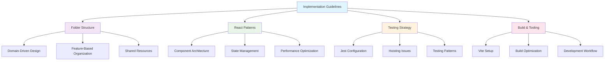
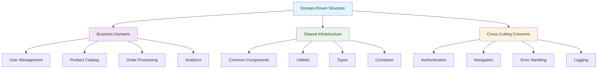
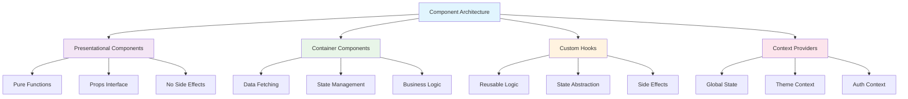
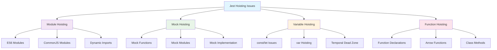
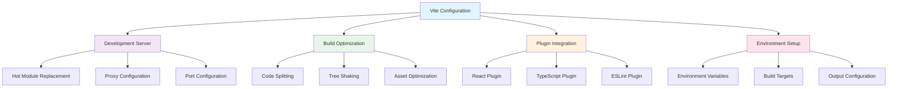

# Implementation Guidelines: Enterprise Development Standards

## Executive Summary

This guide provides comprehensive implementation standards for enterprise applications, covering domain-driven folder structuring, React patterns, Jest hoisting issues, and Vite setup. These guidelines ensure consistency, maintainability, and scalability across development teams.



---

## 1. Domain-Driven Folder Structure

### 1.1 Core Principles



**Universal Principle**: Organize code by business domains rather than technical layers to improve maintainability and team collaboration.

### 1.2 Recommended Structure

```
src/
├── domains/                          # Business domains
│   ├── user/                         # User management domain
│   │   ├── components/               # Domain-specific components
│   │   │   ├── UserProfile/
│   │   │   │   ├── index.ts
│   │   │   │   ├── UserProfile.tsx
│   │   │   │   ├── UserProfile.test.tsx
│   │   │   │   ├── UserProfile.styles.ts
│   │   │   │   └── types.ts
│   │   │   └── UserList/
│   │   │       ├── index.ts
│   │   │       ├── UserList.tsx
│   │   │       ├── UserList.test.tsx
│   │   │       └── types.ts
│   │   ├── hooks/                    # Domain-specific hooks
│   │   │   ├── useUser.ts
│   │   │   ├── useUserPermissions.ts
│   │   │   └── useUserProfile.ts
│   │   ├── services/                 # Domain-specific services
│   │   │   ├── userService.ts
│   │   │   ├── userApi.ts
│   │   │   └── userValidation.ts
│   │   ├── types/                    # Domain-specific types
│   │   │   ├── user.types.ts
│   │   │   └── user.enums.ts
│   │   ├── utils/                    # Domain-specific utilities
│   │   │   ├── userHelpers.ts
│   │   │   └── userTransformers.ts
│   │   └── index.ts                  # Domain exports
│   │
│   ├── product/                      # Product catalog domain
│   │   ├── components/
│   │   │   ├── ProductCard/
│   │   │   ├── ProductList/
│   │   │   └── ProductDetail/
│   │   ├── hooks/
│   │   ├── services/
│   │   ├── types/
│   │   └── index.ts
│   │
│   └── order/                        # Order processing domain
│       ├── components/
│       │   ├── OrderSummary/
│       │   ├── OrderHistory/
│       │   └── OrderStatus/
│       ├── hooks/
│       ├── services/
│       ├── types/
│       └── index.ts
│
├── shared/                           # Shared infrastructure
│   ├── components/                   # Reusable components
│   │   ├── common/                   # Basic UI components
│   │   │   ├── Button/
│   │   │   ├── Input/
│   │   │   ├── Modal/
│   │   │   └── Loading/
│   │   ├── layout/                   # Layout components
│   │   │   ├── Header/
│   │   │   ├── Sidebar/
│   │   │   ├── Footer/
│   │   │   └── PageLayout/
│   │   └── forms/                    # Form components
│   │       ├── FormField/
│   │       ├── FormValidation/
│   │       └── FormSubmit/
│   │
│   ├── hooks/                        # Shared hooks
│   │   ├── useLocalStorage.ts
│   │   ├── useDebounce.ts
│   │   ├── useIntersectionObserver.ts
│   │   └── usePrevious.ts
│   │
│   ├── services/                     # Shared services
│   │   ├── api/                      # API layer
│   │   │   ├── baseApi.ts
│   │   │   ├── httpClient.ts
│   │   │   └── interceptors.ts
│   │   ├── auth/                     # Authentication
│   │   │   ├── authService.ts
│   │   │   ├── tokenManager.ts
│   │   │   └── permissions.ts
│   │   ├── storage/                  # Storage services
│   │   │   ├── localStorage.ts
│   │   │   └── sessionStorage.ts
│   │   └── events/                   # Event system
│   │       ├── eventBus.ts
│   │       └── eventTypes.ts
│   │
│   ├── utils/                        # Shared utilities
│   │   ├── validation.ts
│   │   ├── formatting.ts
│   │   ├── dateHelpers.ts
│   │   └── constants.ts
│   │
│   ├── types/                        # Shared types
│   │   ├── common.types.ts
│   │   ├── api.types.ts
│   │   └── global.types.ts
│   │
│   └── styles/                       # Shared styles
│       ├── theme.ts
│       ├── globalStyles.ts
│       └── mixins.ts
│
├── app/                              # Application layer
│   ├── components/                   # App-level components
│   │   ├── App.tsx
│   │   ├── AppRouter.tsx
│   │   ├── ErrorBoundary.tsx
│   │   └── LoadingSpinner.tsx
│   │
│   ├── providers/                    # Context providers
│   │   ├── AuthProvider.tsx
│   │   ├── ThemeProvider.tsx
│   │   ├── NotificationProvider.tsx
│   │   └── DataProvider.tsx
│   │
│   ├── routes/                       # Routing configuration
│   │   ├── routes.tsx
│   │   ├── routeGuards.tsx
│   │   └── routeTypes.ts
│   │
│   └── store/                        # Global state management
│       ├── slices/
│       │   ├── authSlice.ts
│       │   ├── uiSlice.ts
│       │   └── dataSlice.ts
│       ├── store.ts
│       └── types.ts
│
├── config/                           # Configuration files
│   ├── environment.ts
│   ├── constants.ts
│   └── settings.ts
│
└── index.tsx                         # Application entry point
```

### 1.3 Domain Organization Rules

**✅ DO's:**

1. **Group by business domain** - Organize code around business capabilities
2. **Keep domains independent** - Minimize cross-domain dependencies
3. **Use consistent structure** - Each domain follows the same pattern
4. **Export through index files** - Provide clean public APIs
5. **Separate concerns** - Keep components, hooks, services, and types separate

**❌ DON'Ts:**

1. **Don't organize by technical layers** - Avoid folders like `components/`, `services/`, `utils/`
2. **Don't create deep nesting** - Keep folder depth reasonable (max 4-5 levels)
3. **Don't mix domains** - Keep domain-specific code within its domain
4. **Don't duplicate shared code** - Use shared infrastructure for common functionality

### 1.4 Implementation Example

```typescript
// src/domains/user/index.ts
export { UserProfile } from './components/UserProfile';
export { UserList } from './components/UserList';
export { useUser, useUserPermissions } from './hooks';
export { userService } from './services/userService';
export type { User, UserProfile, UserPermissions } from './types';

// src/domains/user/components/UserProfile/UserProfile.tsx
import React from 'react';
import { useUser } from '../../hooks/useUser';
import { UserProfileProps } from './types';

export const UserProfile: React.FC<UserProfileProps> = ({ userId }) => {
  const { user, isLoading, error } = useUser(userId);

  if (isLoading) return <div>Loading...</div>;
  if (error) return <div>Error: {error.message}</div>;

  return (
    <div className="user-profile">
      <h2>{user.name}</h2>
      <p>{user.email}</p>
    </div>
  );
};

// src/domains/user/hooks/useUser.ts
import { useState, useEffect } from 'react';
import { userService } from '../services/userService';
import type { User } from '../types';

export const useUser = (userId: string) => {
  const [user, setUser] = useState<User | null>(null);
  const [isLoading, setIsLoading] = useState(true);
  const [error, setError] = useState<Error | null>(null);

  useEffect(() => {
    const loadUser = async () => {
      try {
        const userData = await userService.getUser(userId);
        setUser(userData);
      } catch (err) {
        setError(err as Error);
      } finally {
        setIsLoading(false);
      }
    };

    loadUser();
  }, [userId]);

  return { user, isLoading, error };
};
```

---

## 2. React Patterns & Best Practices

### 2.1 Component Architecture



### 2.2 Component Patterns

**✅ CORRECT: Presentational Component**

```typescript
// src/shared/components/common/Button/Button.tsx
import React from 'react';
import { ButtonProps } from './types';

export const Button: React.FC<ButtonProps> = ({
  children,
  variant = 'primary',
  size = 'medium',
  disabled = false,
  onClick,
  className,
  ...props
}) => {
  const baseClasses = 'button';
  const variantClasses = `button--${variant}`;
  const sizeClasses = `button--${size}`;
  const disabledClasses = disabled ? 'button--disabled' : '';

  const combinedClasses = [
    baseClasses,
    variantClasses,
    sizeClasses,
    disabledClasses,
    className
  ].filter(Boolean).join(' ');

  return (
    <button
      className={combinedClasses}
      disabled={disabled}
      onClick={onClick}
      {...props}
    >
      {children}
    </button>
  );
};

// src/shared/components/common/Button/types.ts
export interface ButtonProps {
  children: React.ReactNode;
  variant?: 'primary' | 'secondary' | 'danger' | 'ghost';
  size?: 'small' | 'medium' | 'large';
  disabled?: boolean;
  onClick?: (event: React.MouseEvent<HTMLButtonElement>) => void;
  className?: string;
  type?: 'button' | 'submit' | 'reset';
}
```

**✅ CORRECT: Container Component**

```typescript
// src/domains/user/components/UserList/UserList.tsx
import React, { useState, useEffect } from 'react';
import { useUsers } from '../../hooks/useUsers';
import { UserCard } from '../UserCard';
import { LoadingSpinner } from '../../../../shared/components/common/Loading';
import { ErrorMessage } from '../../../../shared/components/common/ErrorMessage';
import type { User } from '../../types';

export const UserList: React.FC = () => {
  const { users, isLoading, error, refetch } = useUsers();
  const [filteredUsers, setFilteredUsers] = useState<User[]>([]);
  const [searchTerm, setSearchTerm] = useState('');

  useEffect(() => {
    if (users) {
      const filtered = users.filter(user =>
        user.name.toLowerCase().includes(searchTerm.toLowerCase())
      );
      setFilteredUsers(filtered);
    }
  }, [users, searchTerm]);

  if (isLoading) return <LoadingSpinner />;
  if (error) return <ErrorMessage error={error} onRetry={refetch} />;

  return (
    <div className="user-list">
      <input
        type="text"
        placeholder="Search users..."
        value={searchTerm}
        onChange={(e) => setSearchTerm(e.target.value)}
        className="user-list__search"
      />
      <div className="user-list__grid">
        {filteredUsers.map(user => (
          <UserCard key={user.id} user={user} />
        ))}
      </div>
    </div>
  );
};
```

### 2.3 Custom Hooks Patterns

**✅ CORRECT: Custom Hook with Error Handling**

```typescript
// src/shared/hooks/useAsync.ts
import { useState, useEffect, useCallback } from 'react';

interface UseAsyncState<T> {
  data: T | null;
  loading: boolean;
  error: Error | null;
}

interface UseAsyncOptions {
  immediate?: boolean;
  onSuccess?: (data: any) => void;
  onError?: (error: Error) => void;
}

export const useAsync = <T>(
  asyncFunction: (...args: any[]) => Promise<T>,
  options: UseAsyncOptions = {}
) => {
  const { immediate = true, onSuccess, onError } = options;
  
  const [state, setState] = useState<UseAsyncState<T>>({
    data: null,
    loading: false,
    error: null
  });

  const execute = useCallback(async (...args: any[]) => {
    setState(prev => ({ ...prev, loading: true, error: null }));
    
    try {
      const data = await asyncFunction(...args);
      setState({ data, loading: false, error: null });
      onSuccess?.(data);
      return data;
    } catch (error) {
      const errorObj = error instanceof Error ? error : new Error(String(error));
      setState({ data: null, loading: false, error: errorObj });
      onError?.(errorObj);
      throw errorObj;
    }
  }, [asyncFunction, onSuccess, onError]);

  useEffect(() => {
    if (immediate) {
      execute();
    }
  }, [execute, immediate]);

  return {
    ...state,
    execute
  };
};

// Usage example
const useUserData = (userId: string) => {
  return useAsync(
    () => userService.getUser(userId),
    {
      immediate: !!userId,
      onError: (error) => {
        console.error('Failed to load user:', error);
      }
    }
  );
};
```

### 2.4 Performance Optimization

**✅ CORRECT: Memoization Strategy**

```typescript
// src/shared/components/common/DataTable/DataTable.tsx
import React, { useMemo, useCallback } from 'react';
import { DataTableProps, SortConfig } from './types';

export const DataTable: React.FC<DataTableProps> = ({
  data,
  columns,
  sortConfig,
  onSort,
  onRowClick,
  className
}) => {
  // Memoize sorted data
  const sortedData = useMemo(() => {
    if (!sortConfig) return data;

    return [...data].sort((a, b) => {
      const { key, direction } = sortConfig;
      const aValue = a[key];
      const bValue = b[key];

      if (aValue < bValue) return direction === 'asc' ? -1 : 1;
      if (aValue > bValue) return direction === 'asc' ? 1 : -1;
      return 0;
    });
  }, [data, sortConfig]);

  // Memoize row click handler
  const handleRowClick = useCallback((rowId: string) => {
    onRowClick?.(rowId);
  }, [onRowClick]);

  // Memoize sort handler
  const handleSort = useCallback((key: string) => {
    if (!onSort) return;

    const newDirection = sortConfig?.key === key && sortConfig.direction === 'asc' 
      ? 'desc' 
      : 'asc';
    
    onSort({ key, direction: newDirection });
  }, [sortConfig, onSort]);

  return (
    <table className={`data-table ${className || ''}`}>
      <thead>
        <tr>
          {columns.map(column => (
            <th
              key={column.key}
              onClick={() => column.sortable && handleSort(column.key)}
              className={column.sortable ? 'sortable' : ''}
            >
              {column.label}
              {sortConfig?.key === column.key && (
                <span className={`sort-indicator ${sortConfig.direction}`}>
                  {sortConfig.direction === 'asc' ? '↑' : '↓'}
                </span>
              )}
            </th>
          ))}
        </tr>
      </thead>
      <tbody>
        {sortedData.map(row => (
          <tr
            key={row.id}
            onClick={() => handleRowClick(row.id)}
            className="data-table__row"
          >
            {columns.map(column => (
              <td key={column.key}>
                {column.render ? column.render(row[column.key], row) : row[column.key]}
              </td>
            ))}
          </tr>
        ))}
      </tbody>
    </table>
  );
};
```

---

## 3. Testing Strategy & Jest Configuration

### 3.1 Jest Hoisting Issues



### 3.2 Common Hoisting Issues & Solutions

**❌ PROBLEM: Mock hoisting issues**

```typescript
// ❌ INCORRECT: Mock not hoisted properly
import { userService } from '../services/userService';

jest.mock('../services/userService', () => ({
  userService: {
    getUser: jest.fn()
  }
}));

describe('UserComponent', () => {
  it('should load user', async () => {
    // This will fail because the mock isn't hoisted
    userService.getUser.mockResolvedValue({ id: 1, name: 'John' });
  });
});
```

**✅ SOLUTION: Proper mock hoisting**

```typescript
// ✅ CORRECT: Mock hoisted properly
jest.mock('../services/userService', () => ({
  userService: {
    getUser: jest.fn()
  }
}));

import { userService } from '../services/userService';

describe('UserComponent', () => {
  beforeEach(() => {
    jest.clearAllMocks();
  });

  it('should load user', async () => {
    userService.getUser.mockResolvedValue({ id: 1, name: 'John' });
    // Test implementation
  });
});
```

**❌ PROBLEM: Variable hoisting issues**

```typescript
// ❌ INCORRECT: Variable hoisting issue
describe('UserService', () => {
  const mockUser = { id: 1, name: 'John' };
  
  beforeEach(() => {
    // This will fail because mockUser is not hoisted
    userService.getUser.mockResolvedValue(mockUser);
  });
});
```

**✅ SOLUTION: Proper variable hoisting**

```typescript
// ✅ CORRECT: Variables hoisted properly
const mockUser = { id: 1, name: 'John' };

jest.mock('../services/userService', () => ({
  userService: {
    getUser: jest.fn()
  }
}));

import { userService } from '../services/userService';

describe('UserService', () => {
  beforeEach(() => {
    userService.getUser.mockResolvedValue(mockUser);
  });

  it('should return user', async () => {
    const result = await userService.getUser(1);
    expect(result).toEqual(mockUser);
  });
});
```

### 3.3 Jest Configuration

**✅ CORRECT: Jest configuration for React/TypeScript**

```javascript
// jest.config.js
module.exports = {
  // Test environment
  testEnvironment: 'jsdom',
  
  // File extensions to test
  moduleFileExtensions: ['ts', 'tsx', 'js', 'jsx', 'json'],
  
  // Test file patterns
  testMatch: [
    '<rootDir>/src/**/__tests__/**/*.{ts,tsx,js,jsx}',
    '<rootDir>/src/**/*.{test,spec}.{ts,tsx,js,jsx}'
  ],
  
  // Module name mapping
  moduleNameMapping: {
    '^@/(.*)$': '<rootDir>/src/$1',
    '^@shared/(.*)$': '<rootDir>/src/shared/$1',
    '^@domains/(.*)$': '<rootDir>/src/domains/$1',
    '^@app/(.*)$': '<rootDir>/src/app/$1',
    '\\.(css|less|scss|sass)$': 'identity-obj-proxy',
    '\\.(jpg|jpeg|png|gif|eot|otf|webp|svg|ttf|woff|woff2|mp4|webm|wav|mp3|m4a|aac|oga)$':
      '<rootDir>/__mocks__/fileMock.js'
  },
  
  // Setup files
  setupFilesAfterEnv: ['<rootDir>/src/setupTests.ts'],
  
  // Coverage configuration
  collectCoverageFrom: [
    'src/**/*.{ts,tsx,js,jsx}',
    '!src/**/*.d.ts',
    '!src/index.tsx',
    '!src/setupTests.ts'
  ],
  
  // Coverage thresholds
  coverageThreshold: {
    global: {
      branches: 80,
      functions: 80,
      lines: 80,
      statements: 80
    }
  },
  
  // Transform configuration
  transform: {
    '^.+\\.(ts|tsx)$': 'ts-jest',
    '^.+\\.(js|jsx)$': 'babel-jest'
  },
  
  // Module path mapping for TypeScript
  globals: {
    'ts-jest': {
      tsconfig: 'tsconfig.json'
    }
  },
  
  // Clear mocks between tests
  clearMocks: true,
  
  // Restore mocks after each test
  restoreMocks: true
};
```

### 3.4 Testing Patterns

**✅ CORRECT: Component testing with proper mocks**

```typescript
// src/domains/user/components/UserProfile/UserProfile.test.tsx
import React from 'react';
import { render, screen, waitFor } from '@testing-library/react';
import { UserProfile } from './UserProfile';
import { useUser } from '../../hooks/useUser';

// Mock the hook
jest.mock('../../hooks/useUser');
const mockUseUser = useUser as jest.MockedFunction<typeof useUser>;

describe('UserProfile', () => {
  const mockUser = {
    id: '1',
    name: 'John Doe',
    email: 'john@example.com'
  };

  beforeEach(() => {
    jest.clearAllMocks();
  });

  it('should render user profile when data is loaded', async () => {
    mockUseUser.mockReturnValue({
      user: mockUser,
      isLoading: false,
      error: null
    });

    render(<UserProfile userId="1" />);

    expect(screen.getByText('John Doe')).toBeInTheDocument();
    expect(screen.getByText('john@example.com')).toBeInTheDocument();
  });

  it('should show loading state', () => {
    mockUseUser.mockReturnValue({
      user: null,
      isLoading: true,
      error: null
    });

    render(<UserProfile userId="1" />);

    expect(screen.getByText('Loading...')).toBeInTheDocument();
  });

  it('should show error state', () => {
    const error = new Error('Failed to load user');
    mockUseUser.mockReturnValue({
      user: null,
      isLoading: false,
      error
    });

    render(<UserProfile userId="1" />);

    expect(screen.getByText(/Error: Failed to load user/)).toBeInTheDocument();
  });
});
```

**✅ CORRECT: Service testing with proper mocking**

```typescript
// src/domains/user/services/userService.test.ts
import { userService } from './userService';
import { userApi } from './userApi';

// Mock the API
jest.mock('./userApi');
const mockUserApi = userApi as jest.Mocked<typeof userApi>;

describe('userService', () => {
  beforeEach(() => {
    jest.clearAllMocks();
  });

  describe('getUser', () => {
    it('should return user data when API call succeeds', async () => {
      const mockUser = { id: '1', name: 'John Doe' };
      mockUserApi.get.mockResolvedValue({ data: mockUser });

      const result = await userService.getUser('1');

      expect(result).toEqual(mockUser);
      expect(mockUserApi.get).toHaveBeenCalledWith('/users/1');
    });

    it('should throw error when API call fails', async () => {
      const error = new Error('API Error');
      mockUserApi.get.mockRejectedValue(error);

      await expect(userService.getUser('1')).rejects.toThrow('API Error');
    });
  });
});
```

---

## 4. Vite Setup & Configuration

### 4.1 Vite Configuration



### 4.2 Vite Configuration Example

**✅ CORRECT: Vite configuration for React/TypeScript**

```typescript
// vite.config.ts
import { defineConfig } from 'vite';
import react from '@vitejs/plugin-react';
import tsconfigPaths from 'vite-tsconfig-paths';
import { resolve } from 'path';

export default defineConfig({
  plugins: [
    react({
      // React plugin options
      jsxRuntime: 'automatic',
      babel: {
        plugins: [
          ['@babel/plugin-proposal-decorators', { legacy: true }],
          ['@babel/plugin-proposal-class-properties', { loose: true }]
        ]
      }
    }),
    tsconfigPaths()
  ],

  // Resolve configuration
  resolve: {
    alias: {
      '@': resolve(__dirname, 'src'),
      '@shared': resolve(__dirname, 'src/shared'),
      '@domains': resolve(__dirname, 'src/domains'),
      '@app': resolve(__dirname, 'src/app'),
      '@config': resolve(__dirname, 'src/config')
    }
  },

  // Server configuration
  server: {
    port: 3000,
    open: true,
    cors: true,
    proxy: {
      '/api': {
        target: 'http://localhost:8080',
        changeOrigin: true,
        secure: false,
        rewrite: (path) => path.replace(/^\/api/, '')
      },
      '/ws': {
        target: 'ws://localhost:8080',
        ws: true
      }
    }
  },

  // Build configuration
  build: {
    outDir: 'dist',
    sourcemap: true,
    rollupOptions: {
      input: {
        main: resolve(__dirname, 'index.html')
      },
      output: {
        manualChunks: {
          vendor: ['react', 'react-dom'],
          router: ['react-router-dom'],
          ui: ['@mui/material', '@emotion/react', '@emotion/styled']
        }
      }
    },
    chunkSizeWarningLimit: 1000
  },

  // Preview configuration
  preview: {
    port: 4173,
    open: true
  },

  // Environment variables
  define: {
    __DEV__: JSON.stringify(process.env.NODE_ENV === 'development'),
    __PROD__: JSON.stringify(process.env.NODE_ENV === 'production')
  },

  // CSS configuration
  css: {
    modules: {
      localsConvention: 'camelCase'
    },
    preprocessorOptions: {
      scss: {
        additionalData: `@import "@/shared/styles/variables.scss";`
      }
    }
  }
});
```

### 4.3 Environment Configuration

**✅ CORRECT: Environment setup**

```typescript
// src/config/environment.ts
interface Environment {
  NODE_ENV: 'development' | 'production' | 'test';
  API_BASE_URL: string;
  WS_BASE_URL: string;
  APP_NAME: string;
  VERSION: string;
  DEBUG: boolean;
}

const getEnvironment = (): Environment => {
  const env = import.meta.env;

  return {
    NODE_ENV: (env.MODE as Environment['NODE_ENV']) || 'development',
    API_BASE_URL: env.VITE_API_BASE_URL || 'http://localhost:8080/api',
    WS_BASE_URL: env.VITE_WS_BASE_URL || 'ws://localhost:8080/ws',
    APP_NAME: env.VITE_APP_NAME || 'Enterprise App',
    VERSION: env.VITE_APP_VERSION || '1.0.0',
    DEBUG: env.VITE_DEBUG === 'true'
  };
};

export const environment = getEnvironment();

// .env.development
VITE_API_BASE_URL=http://localhost:8080/api
VITE_WS_BASE_URL=ws://localhost:8080/ws
VITE_APP_NAME=Enterprise App (Dev)
VITE_DEBUG=true

// .env.production
VITE_API_BASE_URL=https://api.enterprise.com
VITE_WS_BASE_URL=wss://ws.enterprise.com
VITE_APP_NAME=Enterprise App
VITE_DEBUG=false
```

### 4.4 Build Optimization

**✅ CORRECT: Build optimization strategies**

```typescript
// vite.config.ts (optimized build)
import { defineConfig } from 'vite';
import react from '@vitejs/plugin-react';
import { resolve } from 'path';

export default defineConfig({
  plugins: [react()],
  
  build: {
    // Enable source maps for debugging
    sourcemap: true,
    
    // Optimize chunk splitting
    rollupOptions: {
      output: {
        manualChunks: {
          // Vendor chunks
          'react-vendor': ['react', 'react-dom'],
          'router-vendor': ['react-router-dom'],
          'ui-vendor': ['@mui/material', '@emotion/react', '@emotion/styled'],
          'utils-vendor': ['lodash', 'date-fns', 'axios'],
          
          // Feature chunks
          'user-feature': [
            resolve(__dirname, 'src/domains/user'),
            resolve(__dirname, 'src/domains/user/components'),
            resolve(__dirname, 'src/domains/user/hooks'),
            resolve(__dirname, 'src/domains/user/services')
          ],
          'product-feature': [
            resolve(__dirname, 'src/domains/product'),
            resolve(__dirname, 'src/domains/product/components'),
            resolve(__dirname, 'src/domains/product/hooks'),
            resolve(__dirname, 'src/domains/product/services')
          ]
        }
      }
    },
    
    // Optimize dependencies
    commonjsOptions: {
      include: [/node_modules/]
    },
    
    // Minify options
    minify: 'terser',
    terserOptions: {
      compress: {
        drop_console: true,
        drop_debugger: true
      }
    }
  }
});
```

---

## 5. Development Workflow

### 5.1 Development Scripts

**✅ CORRECT: Package.json scripts**

```json
{
  "scripts": {
    "dev": "vite",
    "build": "tsc && vite build",
    "build:analyze": "tsc && vite build --mode analyze",
    "preview": "vite preview",
    "test": "jest",
    "test:watch": "jest --watch",
    "test:coverage": "jest --coverage",
    "test:ci": "jest --ci --coverage --watchAll=false",
    "lint": "eslint src --ext .ts,.tsx,.js,.jsx",
    "lint:fix": "eslint src --ext .ts,.tsx,.js,.jsx --fix",
    "type-check": "tsc --noEmit",
    "format": "prettier --write \"src/**/*.{ts,tsx,js,jsx,json,css,scss}\"",
    "format:check": "prettier --check \"src/**/*.{ts,tsx,js,jsx,json,css,scss}\"",
    "prepare": "husky install"
  }
}
```

### 5.2 Git Hooks

**✅ CORRECT: Husky configuration**

```json
// .husky/pre-commit
#!/bin/sh
. "$(dirname "$0")/_/husky.sh"

npm run lint
npm run type-check
npm run test:ci
```

```json
// .husky/commit-msg
#!/bin/sh
. "$(dirname "$0")/_/husky.sh"

npx --no -- commitlint --edit $1
```

---

## 6. Best Practices Summary

### ✅ Do's

1. **Organize by business domains** - Group code around business capabilities
2. **Use consistent folder structure** - Follow the same pattern across domains
3. **Implement proper component patterns** - Separate presentational and container components
4. **Use custom hooks for reusable logic** - Abstract complex state and side effects
5. **Configure Jest properly** - Handle hoisting issues and mock dependencies
6. **Optimize Vite configuration** - Enable code splitting and build optimization
7. **Set up proper testing patterns** - Test components, hooks, and services
8. **Use TypeScript consistently** - Define proper types and interfaces
9. **Implement proper error handling** - Handle errors at appropriate levels
10. **Follow performance best practices** - Memoize expensive operations

### ❌ Don'ts

1. **Don't organize by technical layers** - Avoid folders like `components/`, `services/`
2. **Don't create deep nesting** - Keep folder depth reasonable
3. **Don't mix domains** - Keep domain-specific code within its domain
4. **Don't ignore Jest hoisting** - Handle mock and variable hoisting properly
5. **Don't skip testing** - Test all critical functionality
6. **Don't use inconsistent patterns** - Follow established conventions
7. **Don't ignore performance** - Optimize builds and runtime performance
8. **Don't skip error handling** - Handle errors gracefully
9. **Don't use any types** - Define proper TypeScript types
10. **Don't ignore code quality** - Use linting and formatting tools

---

## 7. Implementation Checklist

### Folder Structure
- [ ] Implement domain-driven folder structure
- [ ] Create shared infrastructure layer
- [ ] Set up proper exports through index files
- [ ] Organize components by domain
- [ ] Separate concerns within domains

### React Patterns
- [ ] Implement presentational and container components
- [ ] Create custom hooks for reusable logic
- [ ] Set up proper state management
- [ ] Implement performance optimizations
- [ ] Configure proper TypeScript types

### Testing Strategy
- [ ] Configure Jest properly
- [ ] Handle hoisting issues
- [ ] Set up proper mocking strategies
- [ ] Implement component testing
- [ ] Configure coverage reporting

### Build & Tooling
- [ ] Configure Vite for development and production
- [ ] Set up environment variables
- [ ] Optimize build output
- [ ] Configure development scripts
- [ ] Set up Git hooks

---

## Conclusion

Following these implementation guidelines ensures consistency, maintainability, and scalability across enterprise applications. The domain-driven approach, combined with proper React patterns, testing strategies, and build optimization, provides a solid foundation for building robust applications.

### Key Takeaways

1. **Domain-Driven Design**: Organize code around business capabilities
2. **Component Architecture**: Separate concerns and optimize performance
3. **Testing Strategy**: Handle hoisting issues and implement proper mocking
4. **Build Optimization**: Configure Vite for optimal development and production
5. **Development Workflow**: Set up proper scripts and Git hooks

### Success Metrics

- **Code Organization**: Clear domain boundaries and consistent structure
- **Performance**: < 2s initial load times and < 100ms component render times
- **Test Coverage**: > 80% code coverage with proper mocking
- **Build Performance**: < 30s build times with optimized output
- **Developer Experience**: Fast development server and clear error messages

By following these guidelines, you can build enterprise-grade applications that are maintainable, scalable, and performant.

---

**Last Updated**: January 2025  
**Version**: 1.0  
**Status**: Production Ready 