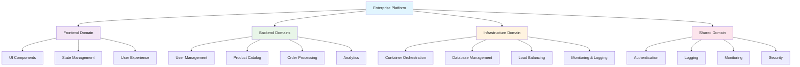
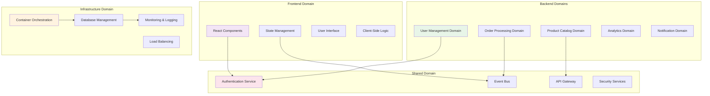
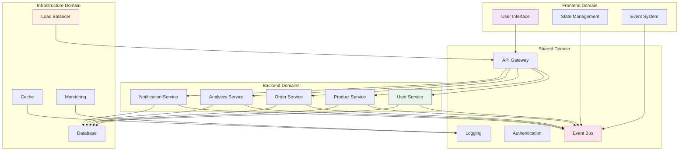
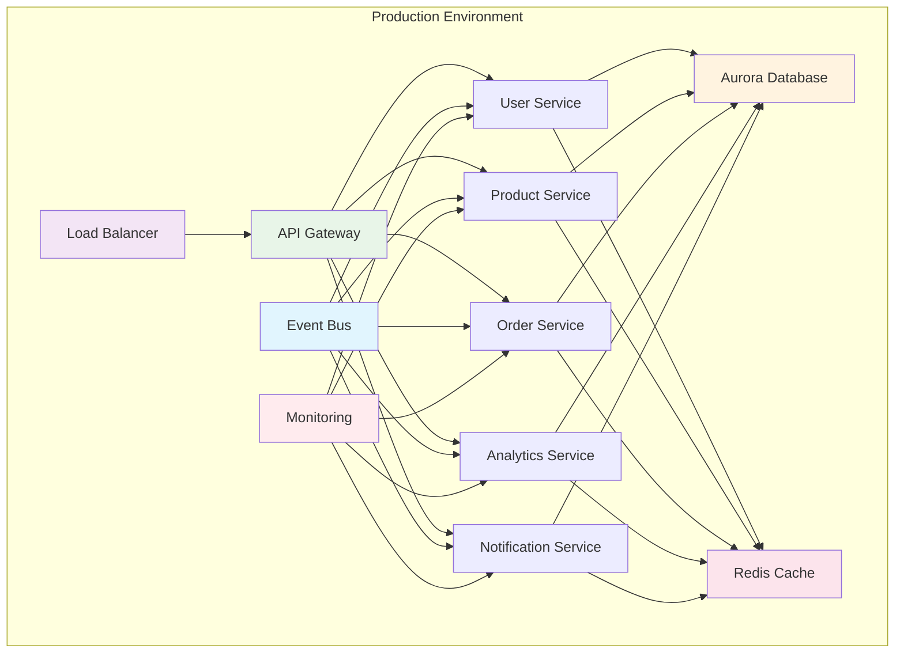

# Infrastructure & Backend Guidelines: Enterprise Deployment Standards

## Executive Summary

This guide provides comprehensive infrastructure and backend implementation standards for enterprise applications, covering containerization with AWS Fargate, Aurora database management, CloudFormation infrastructure as code, and multi-environment deployment patterns. These guidelines ensure scalability, security, cost optimization, and portability across different deployment environments.



---

## 1. Domain Architecture Overview

### 1.1 Enterprise Platform Domains



### 1.2 Domain Responsibilities

#### **Frontend Domain**
- **Purpose**: User interface and client-side application logic
- **Responsibilities**:
  - React component architecture
  - State management (Redux/Zustand)
  - User experience and interactions
  - Client-side routing
  - Progressive Web App features

#### **Backend Domains**
- **User Management Domain**:
  - User authentication and authorization
  - User profiles and preferences
  - Role-based access control
  - User session management

- **Product Catalog Domain**:
  - Product information management
  - Inventory tracking
  - Product search and filtering
  - Category management

- **Order Processing Domain**:
  - Order creation and management
  - Payment processing
  - Order status tracking
  - Fulfillment coordination

- **Analytics Domain**:
  - Data collection and processing
  - Reporting and dashboards
  - Business intelligence
  - Performance metrics

- **Notification Domain**:
  - Email notifications
  - Push notifications
  - In-app messaging
  - Notification preferences

#### **Infrastructure Domain**
- **Purpose**: Platform infrastructure and deployment
- **Responsibilities**:
  - Container orchestration (AWS Fargate)
  - Database management (Aurora PostgreSQL)
  - Load balancing and scaling
  - Monitoring and logging
  - Security and compliance

#### **Shared Domain**
- **Purpose**: Cross-cutting concerns and shared services
- **Responsibilities**:
  - Authentication and authorization
  - Event-driven communication
  - API gateway and routing
  - Security services
  - Common utilities

---

## 2. Repository Structure with Domain Organization

### 2.1 Recommended Organization

```
enterprise-platform/
├── frontend/                          # Frontend Domain
│   ├── src/
│   │   ├── domains/                   # Business domains
│   │   │   ├── user/                  # User management domain
│   │   │   │   ├── components/        # Domain-specific components
│   │   │   │   ├── hooks/             # Domain-specific hooks
│   │   │   │   ├── services/          # Domain-specific services
│   │   │   │   ├── types/             # Domain-specific types
│   │   │   │   └── index.ts           # Domain exports
│   │   │   ├── product/               # Product catalog domain
│   │   │   │   ├── components/
│   │   │   │   ├── hooks/
│   │   │   │   ├── services/
│   │   │   │   ├── types/
│   │   │   │   └── index.ts
│   │   │   ├── order/                 # Order processing domain
│   │   │   │   ├── components/
│   │   │   │   ├── hooks/
│   │   │   │   ├── services/
│   │   │   │   ├── types/
│   │   │   │   └── index.ts
│   │   │   └── analytics/             # Analytics domain
│   │   │       ├── components/
│   │   │       ├── hooks/
│   │   │       ├── services/
│   │   │       ├── types/
│   │   │       └── index.ts
│   │   ├── shared/                    # Shared infrastructure
│   │   │   ├── components/            # Reusable components
│   │   │   ├── hooks/                 # Shared hooks
│   │   │   ├── services/              # Shared services
│   │   │   ├── utils/                 # Shared utilities
│   │   │   ├── types/                 # Shared types
│   │   │   └── styles/                # Shared styles
│   │   ├── app/                       # Application layer
│   │   │   ├── components/            # App-level components
│   │   │   ├── providers/             # Context providers
│   │   │   ├── routes/                # Routing configuration
│   │   │   └── store/                 # Global state management
│   │   └── config/                    # Configuration files
│   ├── public/
│   ├── package.json
│   └── README.md
│
├── backend/                           # Backend Domains
│   ├── services/                      # Microservices
│   │   ├── user-service/              # User Management Domain
│   │   │   ├── src/
│   │   │   │   ├── controllers/       # Request handlers
│   │   │   │   ├── services/          # Business logic
│   │   │   │   ├── models/            # Data models
│   │   │   │   ├── middleware/        # Request middleware
│   │   │   │   ├── utils/             # Domain utilities
│   │   │   │   └── types/             # Domain types
│   │   │   ├── tests/
│   │   │   ├── Dockerfile
│   │   │   └── package.json
│   │   ├── product-service/           # Product Catalog Domain
│   │   │   ├── src/
│   │   │   │   ├── controllers/
│   │   │   │   ├── services/
│   │   │   │   ├── models/
│   │   │   │   ├── middleware/
│   │   │   │   ├── utils/
│   │   │   │   └── types/
│   │   │   ├── tests/
│   │   │   ├── Dockerfile
│   │   │   └── package.json
│   │   ├── order-service/             # Order Processing Domain
│   │   │   ├── src/
│   │   │   │   ├── controllers/
│   │   │   │   ├── services/
│   │   │   │   ├── models/
│   │   │   │   ├── middleware/
│   │   │   │   ├── utils/
│   │   │   │   └── types/
│   │   │   ├── tests/
│   │   │   ├── Dockerfile
│   │   │   └── package.json
│   │   ├── analytics-service/         # Analytics Domain
│   │   │   ├── src/
│   │   │   │   ├── controllers/
│   │   │   │   ├── services/
│   │   │   │   ├── models/
│   │   │   │   ├── middleware/
│   │   │   │   ├── utils/
│   │   │   │   └── types/
│   │   │   ├── tests/
│   │   │   ├── Dockerfile
│   │   │   └── package.json
│   │   └── notification-service/      # Notification Domain
│   │       ├── src/
│   │       │   ├── controllers/
│   │       │   ├── services/
│   │       │   ├── models/
│   │       │   ├── middleware/
│   │       │   ├── utils/
│   │       │   └── types/
│   │       ├── tests/
│   │       ├── Dockerfile
│   │       └── package.json
│   ├── shared/                        # Shared Domain
│   │   ├── middleware/                # Cross-cutting middleware
│   │   │   ├── auth.ts                # Authentication middleware
│   │   │   ├── logging.ts             # Logging middleware
│   │   │   ├── validation.ts          # Request validation
│   │   │   └── error-handling.ts      # Error handling
│   │   ├── utils/                     # Shared utilities
│   │   │   ├── database.ts            # Database utilities
│   │   │   ├── encryption.ts          # Encryption utilities
│   │   │   ├── validation.ts          # Validation utilities
│   │   │   └── constants.ts           # Shared constants
│   │   ├── types/                     # Shared types
│   │   │   ├── common.types.ts        # Common types
│   │   │   ├── api.types.ts           # API types
│   │   │   └── events.types.ts        # Event types
│   │   └── services/                  # Shared services
│   │       ├── event-bus.ts           # Event bus service
│   │       ├── cache.ts               # Cache service
│   │       └── logger.ts              # Logging service
│   └── docker-compose.yml
│
├── infrastructure/                    # Infrastructure Domain
│   ├── cloudformation/                # Infrastructure as Code
│   │   ├── templates/                 # CloudFormation templates
│   │   │   ├── vpc.yml                # VPC configuration
│   │   │   ├── aurora.yml             # Aurora database
│   │   │   ├── fargate.yml            # Fargate services
│   │   │   ├── alb.yml                # Load balancer
│   │   │   └── security.yml           # Security groups
│   │   ├── scripts/                   # Deployment scripts
│   │   └── environments/              # Environment configs
│   │       ├── dev/                   # Development environment
│   │       ├── staging/               # Staging environment
│   │       └── prod/                  # Production environment
│   ├── terraform/                     # Alternative IaC
│   └── scripts/                       # Infrastructure scripts
│
├── deployment/                        # Deployment Configuration
│   ├── docker/                        # Container configuration
│   │   ├── Dockerfile.base            # Base Docker image
│   │   └── docker-compose.yml         # Local development
│   ├── kubernetes/                    # K8s manifests (optional)
│   ├── scripts/                       # Deployment scripts
│   └── configs/                       # Configuration files
│
├── docs/                             # Documentation
│   ├── architecture/                 # Architecture documentation
│   ├── api/                          # API documentation
│   ├── deployment/                   # Deployment guides
│   └── troubleshooting/              # Troubleshooting guides
│
├── scripts/                          # Utility Scripts
│   ├── setup.sh                      # Environment setup
│   ├── deploy.sh                     # Deployment script
│   └── backup.sh                     # Backup script
│
└── README.md
```

### 2.2 Domain Communication Patterns



---

## 3. Domain-Specific Implementation

### 3.1 Frontend Domain Implementation

```typescript
// frontend/src/domains/user/index.ts
export { UserProfile } from './components/UserProfile';
export { UserList } from './components/UserList';
export { useUser, useUserPermissions } from './hooks';
export { userService } from './services/userService';
export type { User, UserProfile, UserPermissions } from './types';

// frontend/src/domains/user/components/UserProfile/UserProfile.tsx
import React from 'react';
import { useUser } from '../../hooks/useUser';
import { UserProfileProps } from './types';

export const UserProfile: React.FC<UserProfileProps> = ({ userId }) => {
  const { user, isLoading, error } = useUser(userId);

  if (isLoading) return <div>Loading...</div>;
  if (error) return <div>Error: {error.message}</div>;

  return (
    <div className="user-profile">
      <h2>{user.name}</h2>
      <p>{user.email}</p>
    </div>
  );
};
```

### 3.2 Backend Domain Implementation

```typescript
// backend/services/user-service/src/controllers/userController.ts
import { Request, Response } from 'express';
import { userService } from '../services/userService';
import { validateUser } from '../utils/validation';

export class UserController {
  async getUser(req: Request, res: Response) {
    try {
      const { userId } = req.params;
      const user = await userService.getUser(userId);
      res.json(user);
    } catch (error) {
      res.status(500).json({ error: error.message });
    }
  }

  async createUser(req: Request, res: Response) {
    try {
      const userData = validateUser(req.body);
      const user = await userService.createUser(userData);
      res.status(201).json(user);
    } catch (error) {
      res.status(400).json({ error: error.message });
    }
  }
}

// backend/services/user-service/src/services/userService.ts
import { User, CreateUserData } from '../types';
import { userRepository } from '../repositories/userRepository';
import { eventBus } from '../../../shared/services/event-bus';

export class UserService {
  async getUser(userId: string): Promise<User> {
    return await userRepository.findById(userId);
  }

  async createUser(userData: CreateUserData): Promise<User> {
    const user = await userRepository.create(userData);
    eventBus.emit('USER_CREATED', { user });
    return user;
  }
}
```

### 3.3 Shared Domain Implementation

```typescript
// backend/shared/services/event-bus.ts
import { EventEmitter } from 'events';

class EventBus extends EventEmitter {
  private static instance: EventBus;

  private constructor() {
    super();
  }

  static getInstance(): EventBus {
    if (!EventBus.instance) {
      EventBus.instance = new EventBus();
    }
    return EventBus.instance;
  }

  emit(event: string, data: any): boolean {
    console.log(`Event emitted: ${event}`, data);
    return super.emit(event, data);
  }
}

export const eventBus = EventBus.getInstance();

// backend/shared/middleware/auth.ts
import { Request, Response, NextFunction } from 'express';
import jwt from 'jsonwebtoken';

export const authMiddleware = (req: Request, res: Response, next: NextFunction) => {
  const token = req.headers.authorization?.split(' ')[1];
  
  if (!token) {
    return res.status(401).json({ error: 'No token provided' });
  }

  try {
    const decoded = jwt.verify(token, process.env.JWT_SECRET!);
    req.user = decoded;
    next();
  } catch (error) {
    res.status(401).json({ error: 'Invalid token' });
  }
};
```

---

## 4. Domain Deployment Strategy

### 4.1 Domain-Specific Deployment

```yaml
# infrastructure/cloudformation/templates/fargate-domains.yml
AWSTemplateFormatVersion: '2010-09-09'
Description: 'Domain-specific Fargate services'

Parameters:
  Environment:
    Type: String
    Default: dev
    AllowedValues: [dev, staging, prod]
    Description: Environment name

Resources:
  # User Service
  UserService:
    Type: AWS::ECS::Service
    Properties:
      ServiceName: !Sub '${Environment}-user-service'
      Cluster: !Ref ECSCluster
      TaskDefinition: !Ref UserServiceTaskDefinition
      DesiredCount: !Ref DesiredCount
      LaunchType: FARGATE
      NetworkConfiguration:
        AwsvpcConfiguration:
          AssignPublicIp: DISABLED
          SecurityGroups:
            - !Ref FargateSecurityGroup
          Subnets:
            Fn::Split:
              - ','
              - Fn::ImportValue: !Sub '${Environment}-private-subnets'

  # Product Service
  ProductService:
    Type: AWS::ECS::Service
    Properties:
      ServiceName: !Sub '${Environment}-product-service'
      Cluster: !Ref ECSCluster
      TaskDefinition: !Ref ProductServiceTaskDefinition
      DesiredCount: !Ref DesiredCount
      LaunchType: FARGATE
      NetworkConfiguration:
        AwsvpcConfiguration:
          AssignPublicIp: DISABLED
          SecurityGroups:
            - !Ref FargateSecurityGroup
          Subnets:
            Fn::Split:
              - ','
              - Fn::ImportValue: !Sub '${Environment}-private-subnets'

  # Order Service
  OrderService:
    Type: AWS::ECS::Service
    Properties:
      ServiceName: !Sub '${Environment}-order-service'
      Cluster: !Ref ECSCluster
      TaskDefinition: !Ref OrderServiceTaskDefinition
      DesiredCount: !Ref DesiredCount
      LaunchType: FARGATE
      NetworkConfiguration:
        AwsvpcConfiguration:
          AssignPublicIp: DISABLED
          SecurityGroups:
            - !Ref FargateSecurityGroup
          Subnets:
            Fn::Split:
              - ','
              - Fn::ImportValue: !Sub '${Environment}-private-subnets'
```

### 4.2 Domain Communication in Production



---

## 5. Domain Monitoring and Observability

### 5.1 Domain-Specific Monitoring

```yaml
# infrastructure/cloudformation/templates/monitoring-domains.yml
Resources:
  # User Service Monitoring
  UserServiceCPUAlarm:
    Type: AWS::CloudWatch::Alarm
    Properties:
      AlarmName: !Sub '${Environment}-user-service-cpu-alarm'
      AlarmDescription: High CPU utilization for User Service
      MetricName: CPUUtilization
      Namespace: AWS/ECS
      Statistic: Average
      Period: 300
      EvaluationPeriods: 2
      Threshold: 80
      ComparisonOperator: GreaterThanThreshold
      Dimensions:
        - Name: ServiceName
          Value: !Sub '${Environment}-user-service'
        - Name: ClusterName
          Value: !Sub '${Environment}-enterprise-cluster'

  # Product Service Monitoring
  ProductServiceCPUAlarm:
    Type: AWS::CloudWatch::Alarm
    Properties:
      AlarmName: !Sub '${Environment}-product-service-cpu-alarm'
      AlarmDescription: High CPU utilization for Product Service
      MetricName: CPUUtilization
      Namespace: AWS/ECS
      Statistic: Average
      Period: 300
      EvaluationPeriods: 2
      Threshold: 80
      ComparisonOperator: GreaterThanThreshold
      Dimensions:
        - Name: ServiceName
          Value: !Sub '${Environment}-product-service'
        - Name: ClusterName
          Value: !Sub '${Environment}-enterprise-cluster'
```

---

## 6. Implementation Checklist

### Domain Architecture
- [ ] Define clear domain boundaries
- [ ] Implement domain-specific services
- [ ] Set up shared domain services
- [ ] Configure domain communication patterns
- [ ] Establish domain monitoring

### Infrastructure Setup
- [ ] Set up VPC with public and private subnets
- [ ] Configure Aurora PostgreSQL cluster
- [ ] Set up ECS Fargate cluster
- [ ] Configure Application Load Balancer
- [ ] Set up CloudWatch monitoring

### Security Configuration
- [ ] Implement least privilege IAM policies
- [ ] Configure security groups
- [ ] Enable encryption at rest and in transit
- [ ] Set up Secrets Manager for sensitive data
- [ ] Configure VPC endpoints for AWS services

### Deployment Pipeline
- [ ] Set up CI/CD pipeline
- [ ] Configure multi-environment deployment
- [ ] Implement blue-green deployment
- [ ] Set up automated testing
- [ ] Configure rollback procedures

### Cost Optimization
- [ ] Implement Fargate Spot instances
- [ ] Configure Aurora Serverless v2
- [ ] Set up auto-scaling policies
- [ ] Monitor and optimize resource usage
- [ ] Implement cost alerts

### Monitoring and Logging
- [ ] Set up CloudWatch dashboards
- [ ] Configure log aggregation
- [ ] Set up alerting and notifications
- [ ] Implement distributed tracing
- [ ] Configure performance monitoring

---

## Conclusion

This infrastructure and backend guidelines provide a comprehensive foundation for building scalable, secure, and cost-effective enterprise applications using AWS services. The domain-driven approach ensures clear separation of concerns, while the container-first approach with Fargate ensures portability across different deployment environments.

### Key Takeaways

1. **Domain-Driven Design**: Organize code around business capabilities
2. **Containerization**: Use Docker for consistent deployments across environments
3. **AWS Fargate**: Serverless container orchestration for cost optimization
4. **Aurora PostgreSQL**: Managed database service for scalability and reliability
5. **CloudFormation**: Infrastructure as code for consistent deployments
6. **Security**: Implement least privilege and encryption at all layers
7. **Cost Optimization**: Use Spot instances and Serverless v2 for cost savings
8. **Monitoring**: Comprehensive logging and monitoring for operational excellence

### Success Metrics

- **Deployment Time**: < 10 minutes for full environment deployment
- **Cost Efficiency**: 40-60% cost savings with Spot instances and Serverless
- **Security**: Zero security vulnerabilities in infrastructure
- **Availability**: 99.9% uptime with multi-AZ deployment
- **Scalability**: Auto-scaling based on demand

By following these guidelines, you can build enterprise-grade infrastructure that is scalable, secure, and cost-effective while maintaining the flexibility to deploy on-premises if needed.

---

**Last Updated**: January 2025  
**Version**: 1.0  
**Status**: Production Ready 